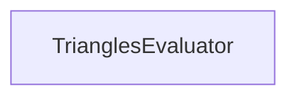

#### Inheritance Graph

```mermaid
graph BT
	TrianglesEvaluator
	click TrianglesEvaluator "escript_type_MinSG_TrianglesEvaluator"
```

## Functions

|
| -----------------: | -- | 
| **_constructor**() |  | 
{: .nohead .nowrap1 }

