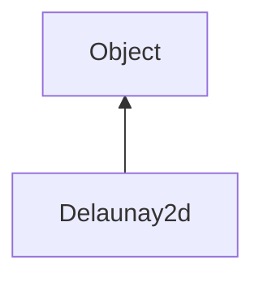

#### Inheritance Graph

## Functions

|
| ---------------------------------------------------------------------------------------------------------------------------------------------: | ------------------------------------------------------ | 
| **_constructor**()                                                                                                                             | [ESF] new Delaunay2d()                                 | 
| **[addPoint](classMinSG_1_1Triangulation_1_1Delaunay2d#classMinSG_1_1Triangulation_1_1Delaunay2d_1af3d1f6259fe799163167bea640388b41)**(p0, p1) | [ESMF] self Delaunay2d.addPoint(Vec2 pos, Object data) | 
| **[createMinSGNodes](namespaceMinSG_1_1Triangulation#namespaceMinSG_1_1Triangulation_1abb2efdb8c66239727398361c40178a40)**()                   | [ESMF] Node Delaunay2d.createMinSGNodes()              | 
| **[generate](classMinSG_1_1Triangulation_1_1Delaunay2d#classMinSG_1_1Triangulation_1_1Delaunay2d_1a797169d49963e12428a080eb081b09b5)**(p0)     | [ESMF] void Delaunay2d.generate(Function)              | 
| **getTriangles**()                                                                                                                             | [ESMF] Array Delaunay2d.getTriangles()                 | 
{: .nohead .nowrap1 }

