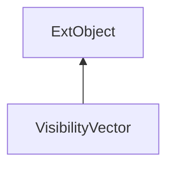

#### Inheritance Graph

## Functions

|
| --------------------------------------------------------------------------------------------------------------------------------------------------------------------------------------------------: | ---------------------------------------------------------------------------------------------------------------------------------------- | 
| **_constructor**()                                                                                                                                                                                  | [ESF] new VisibilityVector()                                                                                                             | 
| **[diff](classMinSG_1_1VisibilitySubdivision_1_1VisibilityVector#classMinSG_1_1VisibilitySubdivision_1_1VisibilityVector_1ab5370d8e3513bff2460a5785d24a43e5)**(p0)                                  | [ESMF] Array VisibilityVector.diff(VisibilityVector)                                                                                     | 
| **[getBenefits](classMinSG_1_1VisibilitySubdivision_1_1VisibilityVector#classMinSG_1_1VisibilitySubdivision_1_1VisibilityVector_1a4c372ee62860ef4720f1aad3ea0a5d9e)**(p0)                           | [ESMF] Number VisibilityVector.getBenefits(GeometryNode)                                                                                 | 
| **[getCosts](classMinSG_1_1VisibilitySubdivision_1_1VisibilityVector#classMinSG_1_1VisibilitySubdivision_1_1VisibilityVector_1abcbf0668760295decf69944e3f232302)**(p0)                              | [ESMF] Number VisibilityVector.getCosts(GeometryNode)                                                                                    | 
| **[getMemoryUsage](classMinSG_1_1VisibilitySubdivision_1_1VisibilityVector#classMinSG_1_1VisibilitySubdivision_1_1VisibilityVector_1aa7171e3352a589a9dca578ea51cac2bf)**()                          | [ESMF] Number VisibilityVector.getMemoryUsage()                                                                                          | 
| **getNodes**()                                                                                                                                                                                      | [ESMF] Array VisibilityVector.getNodes()                                                                                                 | 
| **[getTotalBenefits](classMinSG_1_1VisibilitySubdivision_1_1VisibilityVector#classMinSG_1_1VisibilitySubdivision_1_1VisibilityVector_1ad10a5e60e3e595389533af16250f06b8)**()                        | [ESMF] Number VisibilityVector.getTotalBenefits()                                                                                        | 
| **[getTotalCosts](classMinSG_1_1VisibilitySubdivision_1_1VisibilityVector#classMinSG_1_1VisibilitySubdivision_1_1VisibilityVector_1aa0b1bac700b265a2ff7b144ca1b124f4)**()                           | [ESMF] Number VisibilityVector.getTotalCosts()                                                                                           | 
| **[getVisibleNodeCount](classMinSG_1_1VisibilitySubdivision_1_1VisibilityVector#classMinSG_1_1VisibilitySubdivision_1_1VisibilityVector_1a4d00895b0f61916fcde02c028107f1de)**()                     | [ESMF] Number VisibilityVector.getVisibleNodeCount()                                                                                     | 
| **[makeDifference](classMinSG_1_1VisibilitySubdivision_1_1VisibilityVector#classMinSG_1_1VisibilitySubdivision_1_1VisibilityVector_1aeeb6a283d570a3309610c6ed0aafff91)**(p0)                        | [ESMF] VisibilityVector VisibilityVector.makeDifference(VisibilityVector)                                                                | 
| **[makeMax](classMinSG_1_1VisibilitySubdivision_1_1VisibilityVector#classMinSG_1_1VisibilitySubdivision_1_1VisibilityVector_1ae41bd4c9268ed317c8f6c217a441ca82)**(p0)                               | [ESMF] VisibilityVector VisibilityVector.makeMax(VisibilityVector)                                                                       | 
| **[makeMin](classMinSG_1_1VisibilitySubdivision_1_1VisibilityVector#classMinSG_1_1VisibilitySubdivision_1_1VisibilityVector_1ae9b585355bad78e0ecb3c3f0e662ae30)**(p0)                               | [ESMF] VisibilityVector VisibilityVector.makeMin(VisibilityVector)                                                                       | 
| **[makeSymmetricDifference](classMinSG_1_1VisibilitySubdivision_1_1VisibilityVector#classMinSG_1_1VisibilitySubdivision_1_1VisibilityVector_1a243d59733d8cfaa696580ed3288f37ad)**(p0)               | [ESMF] VisibilityVector VisibilityVector.makeSymmetricDifference(VisibilityVector)                                                       | 
| **[makeWeightedThree](classMinSG_1_1VisibilitySubdivision_1_1VisibilityVector#classMinSG_1_1VisibilitySubdivision_1_1VisibilityVector_1a5d53e5c695cfbf386d29c54a30706bab)**(p0, p1, p2, p3, p4, p5) | [ESMF] VisibilityVector VisibilityVector.makeWeightedThree(Number, VisibilityVector, Number, VisibilityVector, Number, VisibilityVector) | 
| **[serialize](classMinSG_1_1VisibilitySubdivision_1_1VisibilityVector#classMinSG_1_1VisibilitySubdivision_1_1VisibilityVector_1a35fafb0947ec25e62d40dadb694af73f)**(p0)                             | [ESMF] String VisibilityVector.serialize(SceneManager)                                                                                   | 
| **[setNode](classMinSG_1_1VisibilitySubdivision_1_1VisibilityVector#classMinSG_1_1VisibilitySubdivision_1_1VisibilityVector_1af67d294b77700b5b2d434647ad7dfc61)**(p0, p1)                           | [ESMF] self VisibilityVector.setNode(GeometryNode, Number)                                                                               | 
| **[unserialize](classMinSG_1_1VisibilitySubdivision_1_1VisibilityVector#classMinSG_1_1VisibilitySubdivision_1_1VisibilityVector_1a471304d98b15871c3decd2af1dcc66da)**(p0, p1)                       | [ESMF] VisibilityVector VisibilityVector.unserialize(String, SceneManager)                                                               | 
{: .nohead .nowrap1 }

