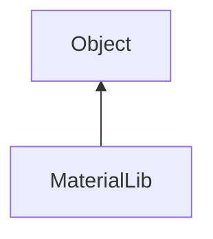

#### Inheritance Graph

```mermaid
graph BT
	MaterialLib
	MaterialLib --> Object
	click MaterialLib "escript_type_MinSG_VoxelWorld_MaterialLib"
	click Object "escript_type_Object"
```

## Functions

|
| -----------------: | --------------------- | 
| **_constructor**() | [ESF] new MaterialLib | 
{: .nohead .nowrap1 }

