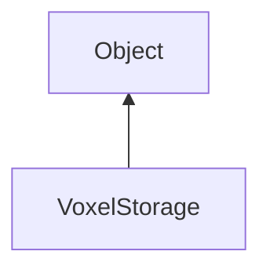

#### Inheritance Graph

## Functions

|
| ---------------------------------------------------------------------------------------------------------------------: | ---------------------------------------- | 
| **_constructor**([p0])                                                                                                 | [ESF] new VoxelStorage(nullVoxel=0)      | 
| **[fill](classGeometry_1_1VoxelStorage#classGeometry_1_1VoxelStorage_1aa86c187b4cd2a9a9c775523a10baa532)**(p0, p1)     | [ESMF] self VoxelStorage.fill(Box, int)  | 
| **[get](classGeometry_1_1VoxelStorage#classGeometry_1_1VoxelStorage_1a969f2d5742967b516880c932b0e20b8d)**(p0)          | [ESMF] Number VoxelStorage.get(Vec3)     | 
| **[getBlockBounds](classGeometry_1_1VoxelStorage#classGeometry_1_1VoxelStorage_1ad74e63a25029c0b0969cf2e5f0c074d5)**() | [ESMF] Box VoxelStorage.getBlockBounds() | 
| **[set](classGeometry_1_1VoxelStorage#classGeometry_1_1VoxelStorage_1aecf6f61e14b2eabe1dabd3e517c821ae)**(p0, p1)      | [ESMF] self VoxelStorage.set(Vec3, int)  | 
{: .nohead .nowrap1 }

