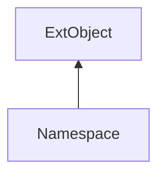

#### Inheritance Graph

```mermaid
graph BT
	Namespace
	Namespace --> ExtObject
	click Namespace "escript_type_Namespace"
	click ExtObject "escript_type_ExtObject"
```

## Functions

|
| -----------------: | ------------------------------ | 
| **_constructor**() | [ESMF] Namespace new Namespace | 
{: .nohead .nowrap1 }

