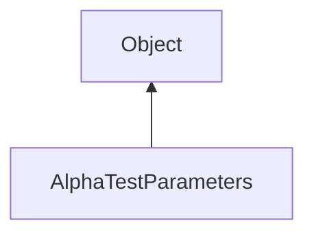

#### Inheritance Graph

## Functions

|
| ------------------------------------------------------------------------------------------------------------------------------------------: | ------------------------------------------------ | 
| **_constructor**([p0 [, p1]])                                                                                                               | new AlphaTestParameters()                        | 
| **[getMode](classRendering_1_1AlphaTestParameters#classRendering_1_1AlphaTestParameters_1a7e0b23cf5edc56447f9d448690b6c84d)**()             | Number AlphaTestParameters.getMode()             | 
| **[getReferenceValue](classRendering_1_1AlphaTestParameters#classRendering_1_1AlphaTestParameters_1ac119acce8a314c7718c07a8166933425)**()   | Number AlphaTestParameters.getReferenceValue()   | 
| **[setMode](classRendering_1_1AlphaTestParameters#classRendering_1_1AlphaTestParameters_1a3bfb2b2031080660b542c06527fd9f9f)**(p0)           | thisEObj AlphaTestParameters.setMode()           | 
| **[setReferenceValue](classRendering_1_1AlphaTestParameters#classRendering_1_1AlphaTestParameters_1a9afbcb652e58ce26c92a2c8f53fd7520)**(p0) | thisEObj AlphaTestParameters.setReferenceValue() | 
{: .nohead .nowrap1 }

