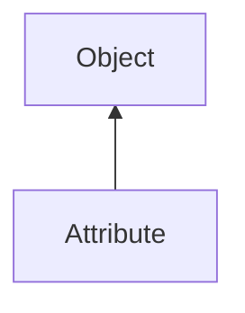

#### Inheritance Graph

## Functions

|
| ---------------------------------------------------------------------------------------------------------------------------: | ------------------------------------- | 
| **[empty](classRendering_1_1VertexAttribute#classRendering_1_1VertexAttribute_1aa6d213ccda3f1952e4109c201338c5d3)**()        | Bool VertexAttribute.empty()          | 
| **[getDataSize](classRendering_1_1VertexAttribute#classRendering_1_1VertexAttribute_1a6964e6fcc905577804cb5c9a39d78d53)**()  | Number VertexAttribute.getDataSize()  | 
| **[getDataType](classRendering_1_1VertexAttribute#classRendering_1_1VertexAttribute_1ae1ab4b2110802f19f24ed77adc7940be)**()  | Number VertexAttribute.getDataType()  | 
| **[getName](classRendering_1_1VertexAttribute#classRendering_1_1VertexAttribute_1ac3c322026421e1f44f265e0d7ad2495a)**()      | String VertexAttribute.getName()      | 
| **[getNormalize](classRendering_1_1VertexAttribute#classRendering_1_1VertexAttribute_1ad8c84474cf4f19f6ca1735051bf252fe)**() | Bool VertexAttribute.getNormalize()   | 
| **[getNumValues](classRendering_1_1VertexAttribute#classRendering_1_1VertexAttribute_1a38e3c6aae161a409fd7dcc13b3f87d68)**() | Number VertexAttribute.getNumValues() | 
| **[getOffset](classRendering_1_1VertexAttribute#classRendering_1_1VertexAttribute_1aa7c1cffb0f8cd8b13beb9e85feb7fc6b)**()    | Number VertexAttribute.getOffset()    | 
{: .nohead .nowrap1 }

