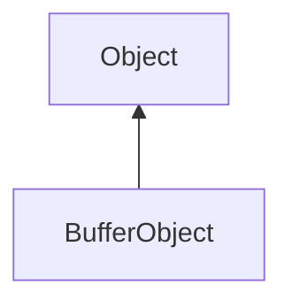

#### Inheritance Graph

## Functions

|
| --------------------------------------------------------------------------------------------------------------------------------------------: | ---------------------------------------------------------------------------------------------------------------------------------------- | 
| **_bind**(p0 [, p1])                                                                                                                          | [ESMF] thisEObj BufferObject._bind(bufferTarget, [location])                                                                             | 
| **_constructor**()                                                                                                                            | [ESMF] BufferObject new BufferObject()                                                                                                   | 
| **_unbind**(p0 [, p1])                                                                                                                        | [ESMF] thisEObj BufferObject._unbind(bufferTarget, [location])                                                                           | 
| **[allocateData](classRendering_1_1BufferObject#classRendering_1_1BufferObject_1adbfe0e0580a50532600282dadadc9f5b)**(p0, p1, p2)              | [ESMF] thisEObj BufferObject.allocateData(bufferTarget, numBytes, usageHint)                                                             | 
| **[clear](classRendering_1_1BufferObject#classRendering_1_1BufferObject_1ab1f079f30d41037a934ba0b5c02d360c)**(p0 [, p1 [, p2 [, p3 [, p4]]]]) | [ESMF] thisEObj BufferObject.clear(bufferTarget, [Number value, [internalFormat=GL_R32UI, format=GL_RED_INTEGER, type=GL_UNSIGNED_INT]]) | 
| **[copy](classRendering_1_1BufferObject#classRendering_1_1BufferObject_1ace2f0a3498a6c0265b43b033bf16b5b9)**(p0, p1, p2, p3)                  | [ESMF] thisEObj BufferObject.copy(BufferObject source, sourceOffset, targetOffset, size)                                                 | 
| **[destroy](classRendering_1_1BufferObject#classRendering_1_1BufferObject_1aada6f2542d4d30ba2626e26190e09d41)**()                             | [ESMF] thisEObj BufferObject.destroy()                                                                                                   | 
| **downloadData**(p0, p1, p2 [, p3])                                                                                                           | [ESF] Array BufferObject.downloadData(bufferTarget, count, type, [offset])                                                               | 
| **[isValid](classRendering_1_1BufferObject#classRendering_1_1BufferObject_1ab2011604658f02487ecc37693af76362)**()                             | [ESMF] Bool BufferObject.isValid()                                                                                                       | 
| **[prepare](classRendering_1_1BufferObject#classRendering_1_1BufferObject_1a18e1e76ba5bf94a41e4df7ddb6abfe71)**()                             | [ESMF] thisEObj BufferObject.prepare()                                                                                                   | 
| **[swap](classRendering_1_1BufferObject#classRendering_1_1BufferObject_1a3470de1772f72fe5004ca892dcd80de1)**()                                | [ESMF] thisEObj BufferObject.swap(E_BufferObject)                                                                                        | 
| **uploadData**(p0, p1, p2 [, p3])                                                                                                             | [ESF] thisEObj BufferObject.uploadData(bufferTarget, Array of float/Vec3/Vec4/Matrix4x4, usageHint, [type])                              | 
| **uploadSubData**(p0, p1, p2 [, p3])                                                                                                          | [ESF] thisEObj BufferObject.uploadSubData(bufferTarget, Array of float/Vec3/Vec4/Matrix4x4, offset, [type])                              | 
{: .nohead .nowrap1 }

