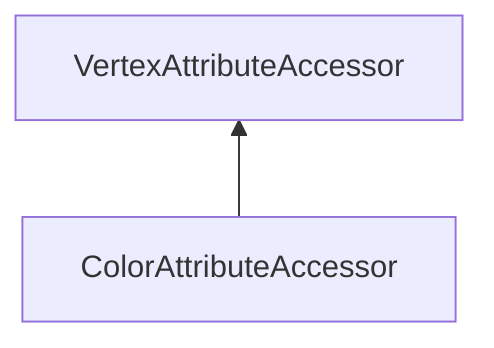

#### Inheritance Graph

## Functions

|
| --------------------------------------------------------------------------------------------------------------------------------------------: | ------------------------------------------------------------------------------------ | 
| **[create](classRendering_1_1ColorAttributeAccessor#classRendering_1_1ColorAttributeAccessor_1a7234d6058ade3fe64a638c3a8fc512bc)**(p0 [, p1]) | [ESF] ColorAttributeAccessor Rendering.ColorAttributeAccessor.create(Mesh, [name])   | 
| **[getColor4f](classRendering_1_1ColorAttributeAccessor#classRendering_1_1ColorAttributeAccessor_1a8cea752a932664955484de47fc7a75a3)**(p0)    | [ESMF] Util.Color4f colorAttributeAccessor.getColor4f(index)                         | 
| **[setColor](classRendering_1_1ColorAttributeAccessor#classRendering_1_1ColorAttributeAccessor_1afcddf79f4e3a23724f646be6e1ace82f)**(p0, p1)  | [ESMF] thisEObj colorAttributeAccessor.setColor(index,Util.Color4f \| Util.Color4ub) | 
{: .nohead .nowrap1 }

