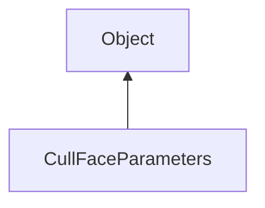

#### Inheritance Graph

## Functions

|
| ------------------------------------------------------------------------------------------------------------------------------: | ------------------------ | 
| **_constructor**([p0])                                                                                                          | new CullFaceParameters() | 
| **[disable](classRendering_1_1CullFaceParameters#classRendering_1_1CullFaceParameters_1a2202950db5f146c06f2f4041486e6c64)**()   |                          | 
| **[enable](classRendering_1_1CullFaceParameters#classRendering_1_1CullFaceParameters_1a52bde839be675583c00430a092ffee43)**()    |                          | 
| **[getMode](classRendering_1_1CullFaceParameters#classRendering_1_1CullFaceParameters_1a49b1b23582b622359980f5ad90c7987f)**()   |                          | 
| **[isEnabled](classRendering_1_1CullFaceParameters#classRendering_1_1CullFaceParameters_1ae720c17d71da20be88bbc332773f8a1d)**() |                          | 
| **[setMode](classRendering_1_1CullFaceParameters#classRendering_1_1CullFaceParameters_1a34e8933c2bb7e0786a6248309b476b2d)**(p0) |                          | 
{: .nohead .nowrap1 }

