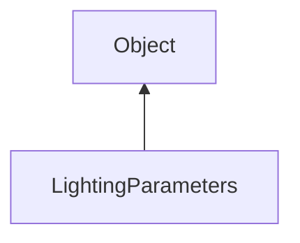

#### Inheritance Graph

```mermaid
graph BT
	LightingParameters
	LightingParameters --> Object
	click LightingParameters "escript_type_Rendering_LightingParameters"
	click Object "escript_type_Object"
```

## Functions

|
| -------------------: | ---------------------------- | 
| **_constructor**(p0) | new LightingParameters(Bool) | 
{: .nohead .nowrap1 }

