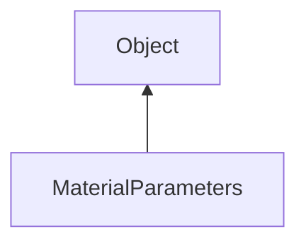

#### Inheritance Graph

## Functions

|
| -----------------------------------------------------------------------------------------------------------------------------------------: | ----------------------------------------------------- | 
| **_constructor**()                                                                                                                         | new MaterialParameters()                              | 
| **[disableColorMaterial](classRendering_1_1MaterialParameters#classRendering_1_1MaterialParameters_1a0dae78003be1fd417116da04205027e8)**() | thisEObj MaterialParameters.disableColorMaterial()    | 
| **[enableColorMaterial](classRendering_1_1MaterialParameters#classRendering_1_1MaterialParameters_1a609b00d8941279d6b418733f49a89048)**()  | thisEObj MaterialParameters.enableColorMaterial()     | 
| **[getAmbient](classRendering_1_1MaterialParameters#classRendering_1_1MaterialParameters_1a2a45c4e617a87e70e89735b8f582b3cb)**()           | Util.Color4f MaterialParameters.getAmbient()          | 
| **[getColorMaterial](classRendering_1_1MaterialParameters#classRendering_1_1MaterialParameters_1ab3ef2fab56ec49a56e4dd05c94412328)**()     | Bool MaterialParameters.getColorMaterial()            | 
| **[getDiffuse](classRendering_1_1MaterialParameters#classRendering_1_1MaterialParameters_1a0caf6706797f78fa643e3015b4416563)**()           | Util.Color4f MaterialParameters.getDiffuse()          | 
| **[getEmission](classRendering_1_1MaterialParameters#classRendering_1_1MaterialParameters_1a8ae0bda1e44c7863bad5bb2d6d37e846)**()          | Util.Color4f MaterialParameters.getEmission()         | 
| **[getShininess](classRendering_1_1MaterialParameters#classRendering_1_1MaterialParameters_1aa11b92427f556ae206bc5b64168ea805)**()         | Number MaterialParameters.getShininess()              | 
| **[getSpecular](classRendering_1_1MaterialParameters#classRendering_1_1MaterialParameters_1a8a57c80433db672895c0d164097019b5)**()          | Util.Color4f MaterialParameters.getSpecular()         | 
| **[setAmbient](classRendering_1_1MaterialParameters#classRendering_1_1MaterialParameters_1a3d345560bfaff4b11cebd717b9c91ebb)**(p0)         | thisEObj MaterialParameters.setAmbient(Util.Color4f)  | 
| **[setDiffuse](classRendering_1_1MaterialParameters#classRendering_1_1MaterialParameters_1a1becd6aa2c0462c4734cdec7e4911472)**(p0)         | thisEObj MaterialParameters.setDiffuse(Util.Color4f)  | 
| **[setEmission](classRendering_1_1MaterialParameters#classRendering_1_1MaterialParameters_1a4779630b013f3b5471a09d1e93b35794)**(p0)        | thisEObj MaterialParameters.setEmission(Util.Color4f) | 
| **[setShininess](classRendering_1_1MaterialParameters#classRendering_1_1MaterialParameters_1a4f99e958f28218e533d9015175d76736)**(p0)       | thisEObj MaterialParameters.setShininess(Float)       | 
| **[setSpecular](classRendering_1_1MaterialParameters#classRendering_1_1MaterialParameters_1aacf960b296ea0e0c99c26f0106e4a749)**(p0)        | thisEObj MaterialParameters.setSpecular(Util.Color4f) | 
{: .nohead .nowrap1 }

