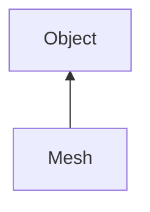

#### Inheritance Graph

## Functions

|
| -----------------------------------------------------------------------------------------------------------------------------: | --------------------------------------------------------------------------------------------------------------------------------------------------------------- | 
| **_constructor**(p0 [, p1 [, p2]])                                                                                             | [ESMF] new Rendering.Mesh( Mesh )                                                                                                                               | 
| **_getIndices**()                                                                                                              | [ESMF] Array Mesh._getIndices()                                                                                                                                 | 
| **_markAsChanged**()                                                                                                           | [ESMF] thisEObj Mesh._markAsChanged() (wrapper for VertexData and IndexData.markAsChanged(), updateBB, and updateIndexRange , as these have no wrapper objects) | 
| **_resize**(p0)                                                                                                                | [ESMF] thisEObj Mesh._resize(Number)                                                                                                                            | 
| **_setIndices**(p0)                                                                                                            | [ESMF] thisEObj Mesh._setIndices(Array)                                                                                                                         | 
| **_swapIndexBuffer**(p0)                                                                                                       | [ESMF] thisEObj Mesh._swapIndexBuffer(BufferObject)                                                                                                             | 
| **_swapVertexBuffer**(p0)                                                                                                      | [ESMF] thisEObj Mesh._swapVertexBuffer(BufferObject)                                                                                                            | 
| **_upload**([p0])                                                                                                              | [ESMF] thisEObj Mesh._upload([usageHint])                                                                                                                       | 
| **assureLocalData**()                                                                                                          | [ESMF] thisEObj Mesh.releaseLocalData()                                                                                                                         | 
| **[getBoundingBox](classRendering_1_1Mesh#classRendering_1_1Mesh_1a3c4102f3ea1ac5e87d4f855ef9fab99d)**()                       | [ESMF] Box Mesh.getBoundingBox()                                                                                                                                | 
| **[getDrawMode](classRendering_1_1Mesh#classRendering_1_1Mesh_1ad1c12d78feb90512dabe3be54dd3f6f7)**()                          | [ESMF] Number Mesh.getDrawMode()                                                                                                                                | 
| **[getFileName](classRendering_1_1Mesh#classRendering_1_1Mesh_1a53c739ebfeee3caf0b5a8a750ffd60fc)**()                          | [ESMF] FileName Mesh.getFileName()                                                                                                                              | 
| **[getGraphicsMemoryUsage](classRendering_1_1Mesh#classRendering_1_1Mesh_1a5db4e4c7113662401d4256dedeadc5f0)**()               | [ESMF] FileName Mesh.getGraphicsMemoryUsage()                                                                                                                   | 
| **[getIndexCount](classRendering_1_1Mesh#classRendering_1_1Mesh_1aaa489018b2efa44bb2e559745a39aa30)**()                        | [ESMF] Number Mesh.getIndexCount()                                                                                                                              | 
| **[getMainMemoryUsage](classRendering_1_1Mesh#classRendering_1_1Mesh_1a3da33fdb4d3c37f8e17d7782c8b0308f)**()                   | [ESMF] FileName Mesh.getMainMemoryUsage()                                                                                                                       | 
| **[getPrimitiveCount](classRendering_1_1Mesh#classRendering_1_1Mesh_1afd36bdd5e8bbc631db616f46be180cdf)**()                    | [ESMF] Number Mesh.getPrimitiveCount()                                                                                                                          | 
| **[getVertexCount](classRendering_1_1Mesh#classRendering_1_1Mesh_1ae785bdde45006a8f57df1ca10ad3de24)**()                       | [ESMF] Number Mesh.getVertexCount()                                                                                                                             | 
| **[getVertexDescription](classRendering_1_1Mesh#classRendering_1_1Mesh_1afa68aa68f8a3bd18ced231bf2f614887)**()                 | [ESMF] VertexDescription Mesh.getVertexDescription()                                                                                                            | 
| **[isUsingIndexData](classRendering_1_1Mesh#classRendering_1_1Mesh_1a0197c8c08d2fb04b2c80fe9e55da1ff2)**()                     | [ESMF] Bool Mesh.isUsingIndexData()                                                                                                                             | 
| **[releaseLocalData](classRendering_1_1MeshVertexData#classRendering_1_1MeshVertexData_1af569b923290ed2a70ba199e9208b5e0a)**() | [ESMF] thisEObj Mesh.releaseLocalData()                                                                                                                         | 
| **setDrawLineStrip**()                                                                                                         | [ESMF] thisEObj Mesh.setDrawLineStrip()                                                                                                                         | 
| **setDrawLines**()                                                                                                             | [ESMF] thisEObj Mesh.setDrawLines()                                                                                                                             | 
| **[setDrawMode](classRendering_1_1Mesh#classRendering_1_1Mesh_1aac0a2cf194d81c7c5d74ba3751cc0ba6)**(p0)                        | [ESMF] thisEObj Mesh.setDrawMode(Number)                                                                                                                        | 
| **setDrawPoints**()                                                                                                            | [ESMF] thisEObj Mesh.setDrawPoints()                                                                                                                            | 
| **setDrawTriangles**()                                                                                                         | [ESMF] thisEObj Mesh.setDrawTriangles()                                                                                                                         | 
| **[setFileName](classRendering_1_1Mesh#classRendering_1_1Mesh_1afe32770f7cd4f7166b7fdd110ee7195b)**([p0])                      | [ESMF] thisEObj Mesh.setFileName([[FileName, String] name])                                                                                                     | 
| **[setUseIndexData](classRendering_1_1Mesh#classRendering_1_1Mesh_1ab57331693b5c396a3fee0d288e9fa471)**(p0)                    | [ESMF] thisEObj Mesh.setUseIndexData(Bool)                                                                                                                      | 
| **[swap](classRendering_1_1Mesh#classRendering_1_1Mesh_1a032b82e018a78f9a8cae618413ffe47f)**(p0)                               | [ESMF] thisEObj Mesh.swap(Mesh)                                                                                                                                 | 
{: .nohead .nowrap1 }

