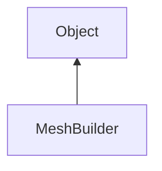

#### Inheritance Graph

## Deprecated

|
| ---------------------------------------------------------------------------------------------------------------------------------------------------------------------------: | ------------------------------------------------------------------------------------------------------------------------------------------------------------------------------------------------------------------------------------------------------------ | 
| ~~[createArrow](classRendering_1_1MeshUtils_1_1MeshBuilder#classRendering_1_1MeshUtils_1_1MeshBuilder_1aa3020488eceff11055993bf8e1b27510)~~(p0, p1)                          | [ESF] (static) Mesh Rendering.MeshBuilder.createArrow(Number radius, Number length) **Deprecated:** use Rendering.createArrow(...) instead.                                                                                                              | 
| ~~[createBox](classRendering_1_1MeshUtils_1_1MeshBuilder#classRendering_1_1MeshUtils_1_1MeshBuilder_1ad4644d03c850539349a795d45d3070ff)~~(p0)                                | [ESF] (static) Mesh Rendering.MeshBuilder.createBox(Box) **Deprecated:** use Rendering.(...) instead.                                                                                                                                                    | 
| ~~[createCone](classRendering_1_1MeshUtils_1_1MeshBuilder#classRendering_1_1MeshUtils_1_1MeshBuilder_1a496895c2d0d3402907d8910ee9924abc)~~(p0, p1, p2)                       | [ESF] (static) Mesh Rendering.MeshBuilder.createCone(Number radius, Number height, Number segments) **Deprecated:** use Rendering.createCone(...) instead.                                                                                               | 
| ~~[createConicalFrustum](classRendering_1_1MeshUtils_1_1MeshBuilder#classRendering_1_1MeshUtils_1_1MeshBuilder_1ae8750d101a922490ffa05cbcb8181ce7)~~(p0, p1, p2, p3)         | [ESF] (static) Mesh Rendering.MeshBuilder.createConicalFrustum(Number radiusBottom, Number radiusTop, Number height, Number segments) **Deprecated:** use Rendering.createConicalFrustum(...) instead.                                                   | 
| ~~[createDiscSector](classRendering_1_1MeshUtils_1_1MeshBuilder#classRendering_1_1MeshUtils_1_1MeshBuilder_1a2190f6a4c599e7b68ead39f7f50db9de)~~(p0, p1 [, p2])              | [ESF] (static) Mesh Rendering.MeshBuilder.createDiscSector(Number radius, Number segments, Number angle) **Deprecated:** use Rendering.createDiscSector(...) instead.                                                                                    | 
| ~~[createDome](classRendering_1_1MeshUtils_1_1MeshBuilder#classRendering_1_1MeshUtils_1_1MeshBuilder_1a3c69b26f84cd89f1f26fdecb05ea1b1f)~~([p0 [, p1 [, p2 [, p3 [, p4]]]]]) | [ESF] (static) Mesh Rendering.MeshBuilder.createDome(radius=100, 					int horiRes = 40, int vertRes = 40, 					double halfSphereFraction = 1.0, 					double imagePercentage = 1.0) **Deprecated:** use Rendering.createDome(...) instead. */ | 
| ~~[createHexGrid](classRendering_1_1MeshUtils_1_1MeshBuilder#classRendering_1_1MeshUtils_1_1MeshBuilder_1ab47d9acae7640fa3f4ec124c8ec96873)~~(p0, p1, p2, p3, p4)            | [ESF] (static) Mesh Rendering.MeshBuilder.createHexGrid(VertexDescription, Number width, Number height, Number rows, Number columns) **Deprecated:** use Rendering.createHexGrid(...) instead.                                                           | 
| ~~[createMeshFromBitmaps](classRendering_1_1MeshUtils_1_1MeshBuilder#classRendering_1_1MeshUtils_1_1MeshBuilder_1a1a91e48d111deb7adcce7bfb70d1d94e)~~(p0 [, p1 [, p2]])      | [ESMF] new Rendering.MeshBuilder.createMeshFromBitmaps(Util.Bitmap depth[, Util.Bitmap color[, Util.Bitmap normals]]) **Deprecated:** use Rendering.createMeshFromBitmaps(...) instead.                                                                  | 
| ~~[createRectangle](classRendering_1_1MeshUtils_1_1MeshBuilder#classRendering_1_1MeshUtils_1_1MeshBuilder_1a632e8d7324e66dd5748970cf301d472b)~~(p0, p1 [, p2])               | [ESF] (static) Mesh Rendering.MeshBuilder.createRectangle([VertexDescription],width,height) **Deprecated:** use Rendering.createRectangle(...) instead.                                                                                                  | 
| ~~[createRingSector](classRendering_1_1MeshUtils_1_1MeshBuilder#classRendering_1_1MeshUtils_1_1MeshBuilder_1a4236043ba69e1c8886a958d280822c83)~~(p0, p1, p2 [, p3])          | [ESF] (static) Mesh Rendering.MeshBuilder.createRingSector(Number innerRadius, Number outerRadius, Number segments, Number angle) **Deprecated:** use Rendering.createRingSector(...) instead.                                                           | 
| ~~[createSphere](classRendering_1_1MeshUtils_1_1MeshBuilder#classRendering_1_1MeshUtils_1_1MeshBuilder_1abf8ba4b5d37af9bcf3d4028fc47fa2ef)~~(p0, p1)                         | [ESF] (static) Mesh Rendering.MeshBuilder.createSphere(Number, Number) **Deprecated:** use Rendering.(...) instead.                                                                                                                                      | 
| ~~[createTorus](classRendering_1_1MeshUtils_1_1MeshBuilder#classRendering_1_1MeshUtils_1_1MeshBuilder_1a37f08a0fd4e321202e65af04606bf9cb)~~(p0, p1, p2, p3)                  | [ESF] (static) Mesh Rendering.MeshBuilder.createTorus(Number, Number, Number, Number) **Deprecated:** use Rendering.createTorus(...) instead.                                                                                                            | 
| ~~[createVoxelMesh](classRendering_1_1MeshUtils_1_1MeshBuilder#classRendering_1_1MeshUtils_1_1MeshBuilder_1acfecba6aa1fb288c05749f75f6a2145d)~~(p0, p1, p2)                  | [ESF] (static) Mesh Rendering.MeshBuilder.createVoxelMesh(VertexDescription, Util.PixelAccessor voxelBitmap, Number depth) **Deprecated:** use Rendering.createVoxelMesh(...) instead.                                                                   | 
{: .nohead .nowrap1 }

## Functions

|
| -----------------------------------------------------------------------------------------------------------------------------------------------------------------------------------------------: | -------------------------------------------------------------------------------------------------------------------------------------------------------------------------------------------- | 
| **_constructor**([p0])                                                                                                                                                                           | [ESMF] new Rendering.MeshBuilder( [VertexDescription] )                                                                                                                                      | 
| **[addIndex](classRendering_1_1MeshUtils_1_1MeshBuilder#classRendering_1_1MeshUtils_1_1MeshBuilder_1a3547fe69e0085b944fe77339e76d8934)**(p0)                                                     | [ESMF] thisEObj MeshBuilder.addIndex( idx )                                                                                                                                                  | 
| **[addMesh](classRendering_1_1MeshUtils_1_1MeshBuilder#classRendering_1_1MeshUtils_1_1MeshBuilder_1af42f605eb46982c46d92a059fca7549e)**(p0)                                                      | [ESMF] thisEObj MeshBuilder.addMesh( Mesh )                                                                                                                                                  | 
| **[addQuad](classRendering_1_1MeshUtils_1_1MeshBuilder#classRendering_1_1MeshUtils_1_1MeshBuilder_1a85a5af54ec460011d2a97d9a2a36ac94)**(p0, p1, p2, p3)                                          | [ESMF] thisEObj MeshBuilder.addQuad( idx,idx,idx,idx )                                                                                                                                       | 
| **[addTriangle](classRendering_1_1MeshUtils_1_1MeshBuilder#classRendering_1_1MeshUtils_1_1MeshBuilder_1a77b906c2fd9f8396367027ddfcedba51)**(p0, p1, p2)                                          | [ESMF] thisEObj MeshBuilder.addSphere( Sphere,inclinationSegments,azimuthSegments ) [ESMF] thisEObj MeshBuilder.addBox( Box ) [ESMF] thisEObj MeshBuilder.addTriangle( idx,idx,idx ) | 
| **[addVertex](classRendering_1_1MeshUtils_1_1MeshBuilder#classRendering_1_1MeshUtils_1_1MeshBuilder_1ae9259a147be7f6da7e4772a8649bd062)**([p0 [, p1 [, p2 [, p3 [, p4 [, p5 [, p6 [, p7]]]]]]]]) | [ESMF] Number MeshBuilder.addVertex( [Vec3f pos ,Vec3 normal, float r, g, b, a, float u, v )                                                                                                 | 
| **[buildMesh](classRendering_1_1MeshUtils_1_1MeshBuilder#classRendering_1_1MeshUtils_1_1MeshBuilder_1a4fd60a434bb3704a77556988fdfd9fbf)**()                                                      | [ESMF] E_Mesh MeshBuilder.buildMesh()                                                                                                                                                        | 
| **[color](classRendering_1_1MeshUtils_1_1MeshBuilder#classRendering_1_1MeshUtils_1_1MeshBuilder_1ad338e7e63af1c21f190e0ddd270fd596)**(p0 [, p1])                                                 | [ESMF] thisEObj MeshBuilder.color( Color4f \| Color4ub, [String attribute] )                                                                                                                 | 
| **[getNextIndex](classRendering_1_1MeshUtils_1_1MeshBuilder#classRendering_1_1MeshUtils_1_1MeshBuilder_1abd0161490502206b3fb09df456dac005)**()                                                   | int MeshBuilder.getNextIndex()                                                                                                                                                               | 
| **[getTransformation](classRendering_1_1MeshUtils_1_1MeshBuilder#classRendering_1_1MeshUtils_1_1MeshBuilder_1a6e96bc0ba4371c87952d6c8f60150945)**()                                              | Matrix4x4 MeshBuilder.getTransformation()                                                                                                                                                    | 
| **[isEmpty](classRendering_1_1MeshUtils_1_1MeshBuilder#classRendering_1_1MeshUtils_1_1MeshBuilder_1ac03061c34c5ac0775cdd5d01b46e1ced)**()                                                        | bool MeshBuilder.isEmpty()                                                                                                                                                                   | 
| **[normal](classRendering_1_1MeshUtils_1_1MeshBuilder#classRendering_1_1MeshUtils_1_1MeshBuilder_1a6bb66a5527bb703440e6786f415f2b3f)**(p0 [, p1])                                                | [ESMF] thisEObj MeshBuilder.normal( Vec3, [String attribute] )                                                                                                                               | 
| **[position](classRendering_1_1MeshUtils_1_1MeshBuilder#classRendering_1_1MeshUtils_1_1MeshBuilder_1af65d5eda5d70609d28fa3db5f41b556c)**(p0 [, p1])                                              | [ESMF] thisEObj MeshBuilder.position( Vec3, [String attribute] )                                                                                                                             | 
| **position2D**(p0 [, p1])                                                                                                                                                                        | [ESMF] thisEObj MeshBuilder.position2D(Vec2, [String attribute])                                                                                                                             | 
| **position4D**(p0 [, p1])                                                                                                                                                                        | [ESMF] thisEObj MeshBuilder.position4D(Vec4, [String attribute])                                                                                                                             | 
| **[setTransformation](classRendering_1_1MeshUtils_1_1MeshBuilder#classRendering_1_1MeshUtils_1_1MeshBuilder_1ad92513f6b304ab575060b1d2436300a9)**(p0)                                            | [ESMF] thisEObj MeshBuilder.setTransformation( Matrix4x4 \| SRT )                                                                                                                            | 
| **[texCoord0](classRendering_1_1MeshUtils_1_1MeshBuilder#classRendering_1_1MeshUtils_1_1MeshBuilder_1a8a92e09cfaf5d04726cf80746be09c6d)**(p0 [, p1])                                             | [ESMF] thisEObj MeshBuilder.texCoord0( Vec2, [String attribute] )                                                                                                                            | 
| **[value](classRendering_1_1MeshUtils_1_1MeshBuilder#classRendering_1_1MeshUtils_1_1MeshBuilder_1ac15b29eff67da0dbb5b488947354421a)**(p0, p1)                                                    | [ESMF] thisEObj MeshBuilder.value(Number value, String attribute)                                                                                                                            | 
| **valueUInt**(p0, p1)                                                                                                                                                                            | [ESMF] thisEObj MeshBuilder.valueUInt(Number value, String attribute)                                                                                                                        | 
| **[values](classRendering_1_1MeshUtils_1_1MeshBuilder#classRendering_1_1MeshUtils_1_1MeshBuilder_1afd8a1c76c100e202a75e2242a8fde9fc)**(p0, p1)                                                   | [ESMF] thisEObj MeshBuilder.values(Array values, String attribute)                                                                                                                           | 
| **valuesUInt**(p0, p1)                                                                                                                                                                           | [ESMF] thisEObj MeshBuilder.valuesUInt(Array values, String attribute)                                                                                                                       | 
{: .nohead .nowrap1 }

## MeshBuilder

|
| ----------------------------------------------------------------------------------------------------------------------------------------------------------------: | ------------------------------------------------------------------------------------------------------------------------------------------------------------ | 
| **addArrow**(p0, p1)                                                                                                                                              | [ESMF] thisEObj Rendering.MeshBuilder.addArrow(float radius, float length)                                                                                   | 
| **addBox**(p0)                                                                                                                                                    | [ESMF] thisEObj Rendering.MeshBuilder.addBox(Box)                                                                                                            | 
| **addCone**(p0, p1, p2)                                                                                                                                           | [ESMF] thisEObj Rendering.MeshBuilder.addCone(float radius, float height, uint8_t numSegments)                                                               | 
| **addConicalFrustum**(p0, p1, p2, p3)                                                                                                                             | [ESMF] thisEObj Rendering.MeshBuilder.addConicalFrustum(float radiusBottom, float radiusTop, float height, uint8_t numSegments)                              | 
| **[addCube](namespaceRendering_1_1MeshUtils_1_1PlatonicSolids#namespaceRendering_1_1MeshUtils_1_1PlatonicSolids_1acab6e71e2857cb9069f58e8fcdfdf6bd)**()           | [ESMF] thisEObj Rendering.MeshBuilder.addCube()                                                                                                              | 
| **addDiscSector**(p0, p1 [, p2])                                                                                                                                  | [ESMF] thisEObj Rendering.MeshBuilder.addDiscSector(float radius, uint8_t numSegments, float angle)                                                          | 
| **[addDodecahedron](namespaceRendering_1_1MeshUtils_1_1PlatonicSolids#namespaceRendering_1_1MeshUtils_1_1PlatonicSolids_1aa988a16a40793e4a57b247682d1536b2)**()   | [ESMF] thisEObj Rendering.MeshBuilder.addDodecahedron()                                                                                                      | 
| **addDome**([p0 [, p1 [, p2 [, p3 [, p4]]]]])                                                                                                                     | [ESMF] thisEObj Rendering.MeshBuilder.addDome(radius=100, int horiRes = 40, int vertRes = 40, double halfSphereFraction = 1.0, double imagePercentage = 1.0) | 
| **addGrid**(p0, p1, p2, p3)                                                                                                                                       | [ESMF] thisEObj Rendering.MeshBuilder.addGrid(float width, float height, uint32_t rows, uint32_t columns)                                                    | 
| **addHexGrid**(p0, p1, p2, p3)                                                                                                                                    | [ESMF] thisEObj Rendering.MeshBuilder.addHexGrid(float width, float height, uint32_t rows, uint32_t columns)                                                 | 
| **[addIcosahedron](namespaceRendering_1_1MeshUtils_1_1PlatonicSolids#namespaceRendering_1_1MeshUtils_1_1PlatonicSolids_1a952d9cbf4636e1f8ef1741da4da158f1)**()    | [ESMF] thisEObj Rendering.MeshBuilder.addIcosahedron()                                                                                                       | 
| **[addLine](namespaceRendering_1_1MeshUtils_1_1WireShapes#namespaceRendering_1_1MeshUtils_1_1WireShapes_1a40c54f6e30c3f621d4ed256175a9b6c0)**(p0, p1)             | [ESMF] thisEObj Rendering.MeshBuilder.addLine(float radius, float length)                                                                                    | 
| **addMeshFromBitmaps**(p0 [, p1 [, p2]])                                                                                                                          | [ESMF] thisEObj Rendering.MeshBuilder.addMeshFromBitmaps(Util.PixelAccessor depth, [Util.PixelAccessor color, [Util.PixelAccessor normal]])                  | 
| **[addOctahedron](namespaceRendering_1_1MeshUtils_1_1PlatonicSolids#namespaceRendering_1_1MeshUtils_1_1PlatonicSolids_1ad5e74dd38b07d070cb4344efb8128341)**()     | [ESMF] thisEObj Rendering.MeshBuilder.addOctahedron()                                                                                                        | 
| **addRectangle**(p0 [, p1])                                                                                                                                       | [ESMF] thisEObj Rendering.MeshBuilder.addRectangle(Rect \| [width,height])                                                                                   | 
| **addRingSector**(p0, p1, p2 [, p3])                                                                                                                              | [ESMF] thisEObj Rendering.MeshBuilder.addRingSector(float innerRadius, float outerRadius, uint8_t numSegments, float angle)                                  | 
| **addSphere**(p0, p1, p2)                                                                                                                                         | [ESMF] thisEObj Rendering.MeshBuilder.addSphere(Sphere, inclinationSegments, azimuthSegments)                                                                | 
| **[addTetrahedron](namespaceRendering_1_1MeshUtils_1_1PlatonicSolids#namespaceRendering_1_1MeshUtils_1_1PlatonicSolids_1a72dfdd60b4e0f5db60d4063f59f18d87)**()    | [ESMF] thisEObj Rendering.MeshBuilder.addTetrahedron()                                                                                                       | 
| **addTorus**(p0, p1, p2, p3)                                                                                                                                      | [ESMF] thisEObj Rendering.MeshBuilder.addTorus(float innerRadius, float outerRadius, uint32_t majorSegments, uint32_t minorSegments)                         | 
| **addVoxelMesh**(p0, p1)                                                                                                                                          | [ESMF] thisEObj Rendering.MeshBuilder.addVoxelMesh(Util.PixelAccessor voxelBitmap, Number depth)                                                             | 
| **[addWireBox](namespaceRendering_1_1MeshUtils_1_1WireShapes#namespaceRendering_1_1MeshUtils_1_1WireShapes_1a5b1a87e2e542e0975289bf5984812c04)**(p0)              | [ESMF] thisEObj Rendering.MeshBuilder.addWireBox(Box)                                                                                                        | 
| **[addWireCircle](namespaceRendering_1_1MeshUtils_1_1WireShapes#namespaceRendering_1_1MeshUtils_1_1WireShapes_1aa0510078a75babc9265e897134802567)**(p0, p1)       | [ESMF] thisEObj Rendering.MeshBuilder.addWireCircle(float radius, uint8_t numSegments, float angle)                                                          | 
| **[addWireFrustum](namespaceRendering_1_1MeshUtils_1_1WireShapes#namespaceRendering_1_1MeshUtils_1_1WireShapes_1a27ef50487be4ec85836db995eabdf652)**(p0)          | [ESMF] thisEObj Rendering.MeshBuilder.addWireFrustum(Frustum)                                                                                                | 
| **[addWireRectangle](namespaceRendering_1_1MeshUtils_1_1WireShapes#namespaceRendering_1_1MeshUtils_1_1WireShapes_1a74def440dd422072a2eafc5696ea5c85)**(p0 [, p1]) | [ESMF] thisEObj Rendering.MeshBuilder.addWireRectangle(Rect \| [width,height])                                                                               | 
| **[addWireSphere](namespaceRendering_1_1MeshUtils_1_1WireShapes#namespaceRendering_1_1MeshUtils_1_1WireShapes_1a2a5d09967ae9b796e737acf5d7523c7c)**(p0, p1)       | [ESMF] thisEObj Rendering.MeshBuilder.addWireSphere(Sphere, segments)                                                                                        | 
{: .nohead .nowrap1 }

