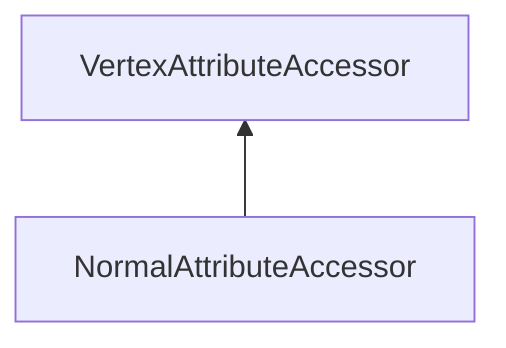

#### Inheritance Graph

## Functions

|
| ----------------------------------------------------------------------------------------------------------------------------------------------: | ----------------------------------------------------------------------------------- | 
| **[create](classRendering_1_1NormalAttributeAccessor#classRendering_1_1NormalAttributeAccessor_1a56395524e17f713c819499fb24e0f78e)**(p0 [, p1]) | [ESF] NormalAttributeAccessor Rendering.NormalAttributeAccessor.create(Mesh,[name]) | 
| **[getNormal](classRendering_1_1NormalAttributeAccessor#classRendering_1_1NormalAttributeAccessor_1a1112dfac118efb5ac78fda61f7c72202)**(p0)     | [ESMF] Geometry.Vec3 colorAttributeAccessor.getNormal(index)                        | 
| **[setNormal](classRendering_1_1NormalAttributeAccessor#classRendering_1_1NormalAttributeAccessor_1ae8023501b909897153429e8c6fc54805)**(p0, p1) | [ESMF] thisEObj colorAttributeAccessor.setNormal(Geometry.Vec3)                     | 
{: .nohead .nowrap1 }

