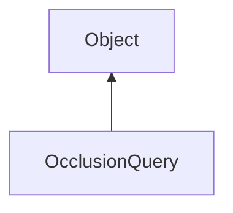

#### Inheritance Graph

## Functions

|
| ------------------------------------------------------------------------------------------------------------------------------: | -------------- | 
| **_constructor**()                                                                                                              | constructor    | 
| **[begin](classRendering_1_1QueryObject#classRendering_1_1QueryObject_1acb5888624e444962c79161e0caf0e618)**()                   |                | 
| **[disableTestMode](classRendering_1_1OcclusionQuery#classRendering_1_1OcclusionQuery_1a1beca2ba9d76f36ab9580d8a7ba46bc6)**(p0) |                | 
| **[enableTestMode](classRendering_1_1OcclusionQuery#classRendering_1_1OcclusionQuery_1ab12f7a74dd31dd117478ae5d735fcccd)**(p0)  | static methods | 
| **[end](classRendering_1_1QueryObject#classRendering_1_1QueryObject_1a2495df860cb27046c5777a047801ba8e)**()                     |                | 
| **[getResult](classRendering_1_1QueryObject#classRendering_1_1QueryObject_1a40088fac48692629a955026998ca1eae)**()               |                | 
| **[isResultAvailable](classRendering_1_1QueryObject#classRendering_1_1QueryObject_1aac18d4343578dca12a3c99915a2c56a5)**()       | methods        | 
{: .nohead .nowrap1 }

