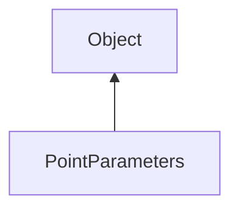

#### Inheritance Graph

## Functions

|
| ------------------------------------------------------------------------------------------------------------------------------------: | ------------------------------------------------ | 
| **_constructor**([p0 [, p1]])                                                                                                         | new PointParameters([size[,smoth]])              | 
| **[disablePointSmoothing](classRendering_1_1PointParameters#classRendering_1_1PointParameters_1a7278e287feb51fad0354bcb94f0f4ba6)**() | thisEObj PointParameters.disablePointSmoothing() | 
| **[enablePointSmoothing](classRendering_1_1PointParameters#classRendering_1_1PointParameters_1a25dea054b918991368e3e56e5fe75252)**()  | thisEObj PointParameters.enablePointSmoothing()  | 
| **[getSize](classRendering_1_1PointParameters#classRendering_1_1PointParameters_1a433aa4c541380e1ab018b8c7b6597fa6)**()               | Number PointParameters.getSize()                 | 
| **[setSize](classRendering_1_1PointParameters#classRendering_1_1PointParameters_1a6075bc70da4a0b2314a0ca1aa6f390dd)**(p0)             | thisEObj PointParameters.setSize()               | 
{: .nohead .nowrap1 }

