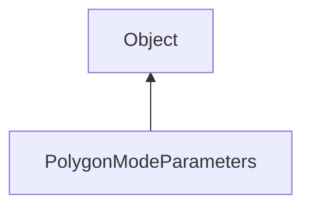

#### Inheritance Graph

## Attributes

|
| --------: | -- | 
| **FILL**  |  | 
| **LINE**  |  | 
| **POINT** |  | 
{: .nohead .nowrap1 }

## Functions

|
| ------------------------------------------------------------------------------------------------------------------------------------: | ---------------------------------------- | 
| **_constructor**([p0])                                                                                                                | new PolygonModeParameters()              | 
| **[getMode](classRendering_1_1PolygonModeParameters#classRendering_1_1PolygonModeParameters_1a0979cb2f20640496d8fbe18fbe15f3c0)**()   | Number PolygonModeParameters.getMode()   | 
| **[setMode](classRendering_1_1PolygonModeParameters#classRendering_1_1PolygonModeParameters_1aed558ef584d0f0997f1502fb732fb4f1)**(p0) | thisEObj PolygonModeParameters.setMode() | 
{: .nohead .nowrap1 }

