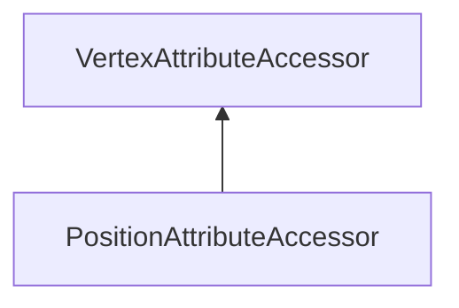

#### Inheritance Graph

## Functions

|
| ----------------------------------------------------------------------------------------------------------------------------------------------------: | --------------------------------------------------------------------------------------- | 
| **[create](classRendering_1_1PositionAttributeAccessor#classRendering_1_1PositionAttributeAccessor_1ac059556299abb998225569e525684d24)**(p0 [, p1])   | [ESF] PositionAttributeAccessor Rendering.PositionAttributeAccessor.create(Mesh,[name]) | 
| **[getPosition](classRendering_1_1PositionAttributeAccessor#classRendering_1_1PositionAttributeAccessor_1a2119fd10a4ddaba4008bc8983d999feb)**(p0)     | [ESMF] Geometry.Vec3 colorAttributeAccessor.getPosition(index)                          | 
| **[setPosition](classRendering_1_1PositionAttributeAccessor#classRendering_1_1PositionAttributeAccessor_1a90c18bb5af2f9c287c6c18b934fe58b7)**(p0, p1) | [ESMF] thisEObj colorAttributeAccessor.setPosition(Geometry.Vec3)                       | 
{: .nohead .nowrap1 }

