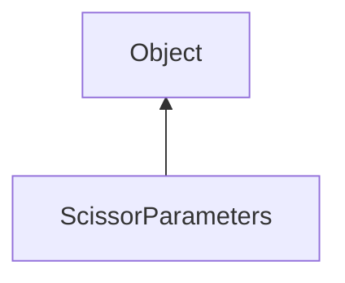

#### Inheritance Graph

```mermaid
graph BT
	ScissorParameters
	ScissorParameters --> Object
	click ScissorParameters "escript_type_Rendering_ScissorParameters"
	click Object "escript_type_Object"
```

## Functions

|
| ---------------------: | ----------------------------- | 
| **_constructor**([p0]) | new ScissorParameters([Rect]) | 
{: .nohead .nowrap1 }

