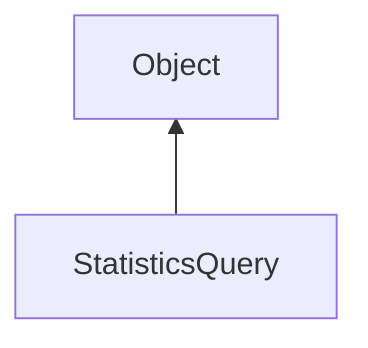

#### Inheritance Graph

## Functions

|
| -------------------------------------------------------------------------------------------------------------------------------------: | -------------- | 
| **[begin](classRendering_1_1QueryObject#classRendering_1_1QueryObject_1acb5888624e444962c79161e0caf0e618)**()                          |                | 
| **[createTimeElapsedQuery](classRendering_1_1StatisticsQuery#classRendering_1_1StatisticsQuery_1a18f51f1f18fada74fb2256871c615b33)**() | static methods | 
| **[end](classRendering_1_1QueryObject#classRendering_1_1QueryObject_1a2495df860cb27046c5777a047801ba8e)**()                            |                | 
| **[getResult](classRendering_1_1QueryObject#classRendering_1_1QueryObject_1a40088fac48692629a955026998ca1eae)**()                      |                | 
| **[getResult64](classRendering_1_1QueryObject#classRendering_1_1QueryObject_1a41727b26eec766b4158cd13f503138e1)**()                    |                | 
| **[isResultAvailable](classRendering_1_1QueryObject#classRendering_1_1QueryObject_1aac18d4343578dca12a3c99915a2c56a5)**()              | methods        | 
{: .nohead .nowrap1 }

