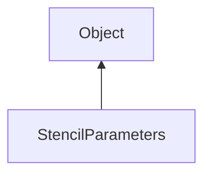

#### Inheritance Graph

## Attributes

|
| ------------: | -- | 
| **DECR**      |  | 
| **DECR_WRAP** |  | 
| **INCR**      |  | 
| **INCR_WRAP** |  | 
| **INVERT**    |  | 
| **KEEP**      |  | 
| **REPLACE**   |  | 
| **ZERO**      |  | 
{: .nohead .nowrap1 }

## Functions

|
| -------------------------------------------------------------------------------------------------------------------------------------------: | ------------------------------------------------------------- | 
| **_constructor**()                                                                                                                           | new StencilParameters()                                       | 
| **[disable](classRendering_1_1StencilParameters#classRendering_1_1StencilParameters_1a713c7724f85d677c7ced308d1f293df7)**()                  | thisEObj StencilParameters.disable()                          | 
| **[enable](classRendering_1_1StencilParameters#classRendering_1_1StencilParameters_1a424b47f428739feee47a3fea48eb3a7c)**()                   | thisEObj StencilParameters.enable()                           | 
| **[getBitMask](classRendering_1_1StencilParameters#classRendering_1_1StencilParameters_1ae9bc2449b090e1447a9ff64716c4a047)**()               | Number PolygonModeParameters.getBitMask()                     | 
| **[getDepthTestFailAction](classRendering_1_1StencilParameters#classRendering_1_1StencilParameters_1a20f284b6c8a7bbaff938204bc9276ca2)**()   | Number PolygonModeParameters.getDepthTestFailAction()         | 
| **[getDepthTestPassAction](classRendering_1_1StencilParameters#classRendering_1_1StencilParameters_1ac182777247d9611773e01a9234260f40)**()   | Number PolygonModeParameters.getDepthTestPassAction()         | 
| **[getFailAction](classRendering_1_1StencilParameters#classRendering_1_1StencilParameters_1a13da7c65f7d7bd45760a6a70840844c7)**()            | Number PolygonModeParameters.getFailAction()                  | 
| **[getFunction](classRendering_1_1StencilParameters#classRendering_1_1StencilParameters_1a42ac091c95c1306cd09e9974ba3acb7d)**()              | Number PolygonModeParameters.getFunction()                    | 
| **[getReferenceValue](classRendering_1_1StencilParameters#classRendering_1_1StencilParameters_1a3b6b8d53430cd1a97d49527902b14420)**()        | Number PolygonModeParameters.getFunction()                    | 
| **[setBitMask](classRendering_1_1StencilParameters#classRendering_1_1StencilParameters_1ad31149c608ca9dc3d7c416065a0558d4)**(p0)             | thisEObj PolygonModeParameters.setBitMask(String)             | 
| **[setDepthTestFailAction](classRendering_1_1StencilParameters#classRendering_1_1StencilParameters_1aa319fe272c8ca0d98b9f660f3e72ee98)**(p0) | thisEObj PolygonModeParameters.setDepthTestFailAction(Number) | 
| **[setDepthTestPassAction](classRendering_1_1StencilParameters#classRendering_1_1StencilParameters_1a51ff71b2d7af4c8cc9e79185b06ac1b8)**(p0) | thisEObj PolygonModeParameters.setDepthTestPassAction(Number) | 
| **[setFailAction](classRendering_1_1StencilParameters#classRendering_1_1StencilParameters_1a6911ca07da7b68da0bf1c3e270f11a5e)**(p0)          | thisEObj PolygonModeParameters.setFailAction(Number)          | 
| **[setFunction](classRendering_1_1StencilParameters#classRendering_1_1StencilParameters_1a3b8054ace210b3f0f38e9d47293fb901)**(p0)            | thisEObj PolygonModeParameters.setFunction(Number)            | 
| **[setReferenceValue](classRendering_1_1StencilParameters#classRendering_1_1StencilParameters_1a761085d809d9e3559a479283eb8cf579)**(p0)      | thisEObj PolygonModeParameters.setFunction(Number)            | 
{: .nohead .nowrap1 }

