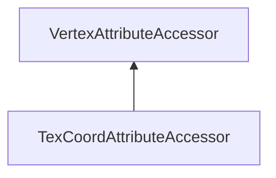

#### Inheritance Graph

## Functions

|
| ------------------------------------------------------------------------------------------------------------------------------------------------------: | --------------------------------------------------------------------------------------- | 
| **[create](classRendering_1_1TexCoordAttributeAccessor#classRendering_1_1TexCoordAttributeAccessor_1a47396da8e5cd3086898b4c0e0252cd4d)**(p0 [, p1])     | [ESF] TexCoordAttributeAccessor Rendering.TexCoordAttributeAccessor.create(Mesh,[name]) | 
| **[getCoordinate](classRendering_1_1TexCoordAttributeAccessor#classRendering_1_1TexCoordAttributeAccessor_1a8a99fdfa239aac09a1cea77b7d8f8a5f)**(p0)     | [ESMF] Geometry.Vec2 colorAttributeAccessor.getCoordinate(index)                        | 
| **[setCoordinate](classRendering_1_1TexCoordAttributeAccessor#classRendering_1_1TexCoordAttributeAccessor_1a55b9f992080ade39eedcde25c64a6f4d)**(p0, p1) | [ESMF] thisEObj colorAttributeAccessor.setCoordinate(Geometry.Vec2)                     | 
{: .nohead .nowrap1 }

