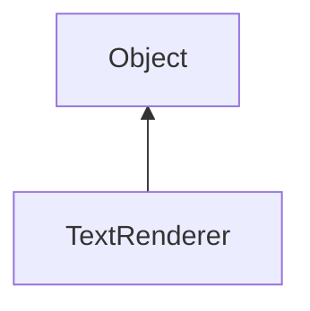

#### Inheritance Graph

## Functions

|
| ---------------------------------------------------------------------------------------------------------------------------: | -------------------------------------------------------------------- | 
| **_constructor**(p0, p1)                                                                                                     | [ESF] new TextRenderer(String, Number)                               | 
| **[draw](classRendering_1_1TextRenderer#classRendering_1_1TextRenderer_1ac81765143cf88e1aed368b2e5d651c3e)**(p0, p1, p2, p3) | [ESMF] self TextRenderer.draw(RenderingContext, String, Vec2, Color) | 
| **[getTextSize](classRendering_1_1TextRenderer#classRendering_1_1TextRenderer_1a18e552794a0e597b2ac213c611c7b947)**(p0)      | [ESMF] Rect TextRenderer.getTextSize(String)                         | 
{: .nohead .nowrap1 }

