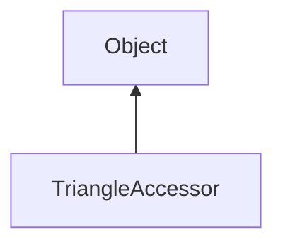

#### Inheritance Graph

## Functions

|
| ------------------------------------------------------------------------------------------------------------------------------------------------------------: | ------------------------------------------------------------------------------------- | 
| **[create](classRendering_1_1MeshUtils_1_1TriangleAccessor#classRendering_1_1MeshUtils_1_1TriangleAccessor_1a9be066ede1f2c02dab6f36fe78a1b6a2)**(p0)          | [ESF] TriangleAccessor Rendering.MeshUtils.TriangleAccessor.create(Mesh,name)         | 
| **[getIndices](classRendering_1_1MeshUtils_1_1TriangleAccessor#classRendering_1_1MeshUtils_1_1TriangleAccessor_1a21cf648044211b0cb3f5d68e3273b1a3)**(p0)      | [ESMF] Array TriangleAccessor.getTriangle(index)                                      | 
| **[getTriangle](classRendering_1_1MeshUtils_1_1TriangleAccessor#classRendering_1_1MeshUtils_1_1TriangleAccessor_1a58587fd595c8f36a0e0fda18dcfbbb37)**(p0)     | [ESMF] Geometry.Triangle<Geometry::Vec3> TriangleAccessor.getTriangle(index)          | 
| **[setTriangle](classRendering_1_1MeshUtils_1_1TriangleAccessor#classRendering_1_1MeshUtils_1_1TriangleAccessor_1acdab5340e81a4b08891f1b468c5fb843)**(p0, p1) | [ESMF] thisEObj TriangleAccessor.setTriangle(index,Geometry.Triangle<Geometry::Vec3>) | 
{: .nohead .nowrap1 }

