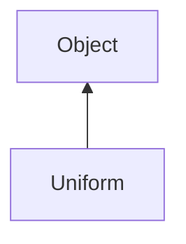

#### Inheritance Graph

## Attributes

|
| --------------: | -- | 
| **BOOL**        |  | 
| **FLOAT**       |  | 
| **INT**         |  | 
| **MATRIX_2X2F** |  | 
| **MATRIX_3X3F** |  | 
| **MATRIX_4X4F** |  | 
| **VEC2B**       |  | 
| **VEC2F**       |  | 
| **VEC2I**       |  | 
| **VEC3B**       |  | 
| **VEC3F**       |  | 
| **VEC3I**       |  | 
| **VEC4B**       |  | 
| **VEC4F**       |  | 
| **VEC4I**       |  | 
{: .nohead .nowrap1 }

## Functions

|
| -----------------------------------------------------------------------------------------------------------: | ------------------------------------------------------------------------------------------------------------------------------------------------------------------------------------------------------------------------------------------------------------------------------------------------------------------------------------------------------------------------------------------------------------------------------------------------------------------------------------------------------------------------------------------------------------------------------------------------------------------------------------------------------------------------------------------------------------------------------------------------------------------------------------------------------------------------------------------------------------------------------------------------------------------- | 
| **_constructor**(p0 [, p1 [, p2]])                                                                           | [ESMF] new Rendering.Uniform( Uniform \| String name, Number type, Array values) Depending on type, the type of values in the Array may differ:  Uniform::UNIFORM_BOOL:	Bool Uniform::UNIFORM_VEC2B:	[x,y] (bool) Uniform::UNIFORM_VEC3B:	[x,y,z] (bool) Uniform::UNIFORM_VEC4B:	[x,y,z,w] (bool)  Uniform::UNIFORM_FLOAT:	Number (float) Uniform::UNIFORM_VEC2F:	[x,y], Vec2 (float) Uniform::UNIFORM_VEC3F:	[x,y,z], Vec3 (float) Uniform::UNIFORM_VEC4F:	[x,y,z,w], Vec4 (float), Color4f  Uniform::UNIFORM_INT:	Number (int) Uniform::UNIFORM_VEC2I:	[x,y], Vec2 (int) Uniform::UNIFORM_VEC3I:	[x,y,z], Vec3 (int) Uniform::UNIFORM_VEC4I:	[x,y,z,w], Vec4 (int)  Uniform::UNIFORM_MATRIX_2X2F:	[x\*4] (float) Uniform::UNIFORM_MATRIX_3X3F:	[x\*9] (float), Matrix3x3 Uniform::UNIFORM_MATRIX_4X4F:	[x\*16] (float), Matrix4x4 | 
| **getData**()                                                                                                | [ESMF] Array Uniform.getData()                                                                                                                                                                                                                                                                                                                                                                                                                                                                                                                                                                                                                                                                                                                                                                                                                                                                                      | 
| **[getName](classRendering_1_1Uniform#classRendering_1_1Uniform_1a4bd18ccacc837b268b5106c715117c40)**()      | [ESMF] String Uniform.getName()                                                                                                                                                                                                                                                                                                                                                                                                                                                                                                                                                                                                                                                                                                                                                                                                                                                                                     | 
| **[getNumValues](classRendering_1_1Uniform#classRendering_1_1Uniform_1a08383279a4cc6918ee69343d6f3cf19a)**() | [ESMF] Number Uniform.getNumValues()                                                                                                                                                                                                                                                                                                                                                                                                                                                                                                                                                                                                                                                                                                                                                                                                                                                                                | 
| **[getType](classRendering_1_1Uniform#classRendering_1_1Uniform_1a13acd54b6d43fc371ea7abfc0651da4b)**()      | [ESMF] Number Uniform.getType()                                                                                                                                                                                                                                                                                                                                                                                                                                                                                                                                                                                                                                                                                                                                                                                                                                                                                     | 
| **[isNull](classRendering_1_1Uniform#classRendering_1_1Uniform_1acf7c196c7d82053688e52d131a654545)**()       | [ESMF] Bool Uniform.isNull()                                                                                                                                                                                                                                                                                                                                                                                                                                                                                                                                                                                                                                                                                                                                                                                                                                                                                        | 
{: .nohead .nowrap1 }

