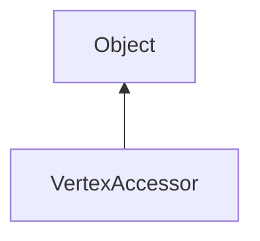

#### Inheritance Graph

## Functions

|
| -------------------------------------------------------------------------------------------------------------------------------------: | -------------------------------------------------------------------------------------------------------------- | 
| **_constructor**(p0)                                                                                                                   | [ESMF] new Rendering.VertexAccessor( Mesh )                                                                    | 
| **[getAttributeLocation](classUtil_1_1ResourceAccessor#classUtil_1_1ResourceAccessor_1aa33bab374ba8e01b02eaf05ef7c2ad49)**(p0)         | [ESMF] Number VertexAccessor.getAttributeLocation(String attribute)                                            | 
| **[getColor4f](classRendering_1_1VertexAccessor#classRendering_1_1VertexAccessor_1ae9cddc32278b298415dbe79fcc136b9d)**(p0 [, p1])      | [ESMF] Util.Color4f VertexAccessor.getColor4f(Number index, [String attribute \| Number location])             | 
| **getFloat**(p0, p1)                                                                                                                   | [ESMF] Number VertexAccessor.getFloat(Number index, String attribute \| Number location)                       | 
| **getFloats**(p0, p1, p2)                                                                                                              | [ESMF] Number VertexAccessor.getFloats(Number index, String attribute \| Number location, Number count)        | 
| **[getNormal](classRendering_1_1VertexAccessor#classRendering_1_1VertexAccessor_1aa729eb2bcb88ce7098ee9470118d8e6c)**(p0 [, p1])       | [ESMF] Geometry.Vec3 VertexAccessor.getNormal(Number index, [String attribute \| Number location])             | 
| **[getPosition](classRendering_1_1VertexAccessor#classRendering_1_1VertexAccessor_1af04ef19172938629ea151a05350e0f64)**(p0 [, p1])     | [ESMF] Geometry.Vec3 VertexAccessor.getPosition(Number index, [String attribute \| Number location])           | 
| **[getTexCoord](classRendering_1_1VertexAccessor#classRendering_1_1VertexAccessor_1a92aae8bf72d5579b029c1ffe6faed5ef)**(p0 [, p1])     | [ESMF] Geometry.Vec2 VertexAccessor.getTexCoord(Number index, [String attribute \| Number location])           | 
| **getUInt**(p0, p1)                                                                                                                    | [ESMF] Number VertexAccessor.getUInt(Number index, String attribute \| Number location)                        | 
| **getUInts**(p0, p1, p2)                                                                                                               | [ESMF] Number VertexAccessor.getUInts(Number index, String attribute \| Number location, Number count)         | 
| **[getVec4](classRendering_1_1VertexAccessor#classRendering_1_1VertexAccessor_1a971db2558e2d809083f678798403eee0)**(p0, p1)            | [ESMF] Geometry.Vec4 VertexAccessor.getVec4(Number index, String attribute \| Number location)                 | 
| **[setColor](classRendering_1_1VertexAccessor#classRendering_1_1VertexAccessor_1afbe12201fdf7ca7cb0e94853f8ac8f61)**(p0, p1 [, p2])    | [ESMF] thisEObj VertexAccessor.setColor(Number index, Util.Color4f, [String attribute \| Number location])     | 
| **setFloat**(p0, p1, p2)                                                                                                               | [ESMF] thisEObj VertexAccessor.setFloat(Number index, String attribute \| Number location, Number value)       | 
| **setFloats**(p0, p1, p2)                                                                                                              | [ESMF] thisEObj VertexAccessor.setFloats(Number index, String attribute, Array values)                         | 
| **[setNormal](classRendering_1_1VertexAccessor#classRendering_1_1VertexAccessor_1ad3cd74511ef55978b069d9574473ef05)**(p0, p1 [, p2])   | [ESMF] thisEObj VertexAccessor.setNormal(Number index, Geometry.Vec3, [String attribute \| Number location])   | 
| **[setPosition](classRendering_1_1VertexAccessor#classRendering_1_1VertexAccessor_1af5323d2be3ef669adf9c42e76ee647fa)**(p0, p1 [, p2]) | [ESMF] thisEObj VertexAccessor.setPosition(Number index, Geometry.Vec3, [String attribute \| Number location]) | 
| **[setTexCoord](classRendering_1_1VertexAccessor#classRendering_1_1VertexAccessor_1a81bcb232d97c748a5194836e9780c958)**(p0, p1 [, p2]) | [ESMF] thisEObj VertexAccessor.setTexCoord(Number index, Geometry.Vec2, [String attribute \| Number location]) | 
| **setUInt**(p0, p1, p2)                                                                                                                | [ESMF] thisEObj VertexAccessor.setUInt(Number index, String attribute \| Number location, Number value)        | 
| **setUInts**(p0, p1, p2)                                                                                                               | [ESMF] thisEObj VertexAccessor.setUInts(Number index, String attribute, Array values)                          | 
| **[setVec4](classRendering_1_1VertexAccessor#classRendering_1_1VertexAccessor_1ab9d5b3ada7656a85068b8bd368e265f3)**(p0, p1, p2)        | [ESMF] thisEObj VertexAccessor.setVec4(Number index, Geometry.Vec4, String attribute \| Number location)       | 
{: .nohead .nowrap1 }

