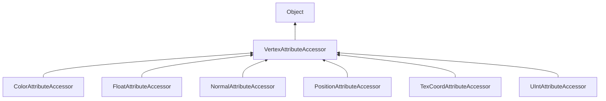

#### Inheritance Graph

## Functions

|
| -------------------------------------------------------------------------------------------------------------------------------------------: | ---------------------------------------------------- | 
| **[checkRange](classRendering_1_1VertexAttributeAccessor#classRendering_1_1VertexAttributeAccessor_1a9426190a0f221fa7d4f87e2d929e5cce)**(p0) | [ESMF] Bool vertexAttributeAccessor.checkRange(uint) | 
{: .nohead .nowrap1 }

