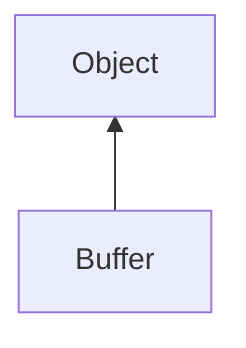

#### Inheritance Graph

## Functions

|
| -------------------------------------------------------------------------------------------------: | ----------------------------------- | 
| **[getBits](classSound_1_1Buffer#classSound_1_1Buffer_1a8b7ef303ecd1be1efa09bcb18edab039)**()      | [ESMF] Number Buffer.getBits()      | 
| **[getChannels](classSound_1_1Buffer#classSound_1_1Buffer_1a10f910ae2f1c0f81bb3b09dce4dc7ef9)**()  | [ESMF] Number Buffer.getChannels()  | 
| **[getDataSize](classSound_1_1Buffer#classSound_1_1Buffer_1a9ba8949d1af34294277f19ca9400468d)**()  | [ESMF] Number Buffer.getDataSize()  | 
| **[getFrequency](classSound_1_1Buffer#classSound_1_1Buffer_1a62e0f66da5ee0b2b7c0585344e13af86)**() | [ESMF] Number Buffer.getFrequency() | 
{: .nohead .nowrap1 }

