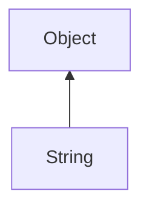

#### Inheritance Graph

## Functions

|
| -------------------------------------------------------------------------------------------------------------------------------------: | ----------------------------------------------------------------------------------- | 
| **\***(p0)                                                                                                                             | [ESMF] String String\*(Number)Obj                                                   | 
| **\*=**(p0)                                                                                                                            | [ESMF] thisObj String\*=(Number)Obj                                                 | 
| **+**(p0)                                                                                                                              | [ESMF] String String+(String)Obj                                                    | 
| **+=**(p0)                                                                                                                             | [ESMF] thisObj String+=(String)Obj                                                  | 
| **&lt;**(p0)                                                                                                                           | [ESMF] bool String<(String)Obj                                                      | 
| **&lt;=**(p0)                                                                                                                          | [ESMF] bool String<=(String)Obj                                                     | 
| **&gt;**(p0)                                                                                                                           | [ESMF] bool String>(String)Obj                                                      | 
| **&gt;=**(p0)                                                                                                                          | [ESMF] bool String>=(String)Obj                                                     | 
| **_constructor**([p0])                                                                                                                 | [ESMF] String new String((String)Obj)                                               | 
| **_createFromByteArray**(p0)                                                                                                           | [ESF] String String._createFromByteArray( [byte\*] )                                | 
| **_get**(p0)                                                                                                                           | [ESMF] String String[(Number)position ]                                             | 
| **[beginsWith](classEScript_1_1StringData#classEScript_1_1StringData_1a17b729e3ac99e29b346c8905db2d5b46)**(p0 [, p1])                  | [ESMF] Bool String.beginsWith( (String)search[,(Number)startIndex] )                | 
| **contains**(p0 [, p1])                                                                                                                | [ESMF] Bool String.contains (String)search [,(Number)startIndex] )                  | 
| **dataSize**()                                                                                                                         | [ESMF] Number String.dataSize()                                                     | 
| **empty**()                                                                                                                            | [ESMF] Bool String.empty()                                                          | 
| **endsWith**(p0)                                                                                                                       | [ESMF] Bool String.endsWith( (String)search )                                       | 
| **fillUp**(p0 [, p1])                                                                                                                  | [ESMF] String String.fillUp(length[, string fill=" ")                               | 
| **[find](classEScript_1_1StringData#classEScript_1_1StringData_1a40ca9c32857f4b72b55f42566530b6b8)**(p0 [, p1])                        | [ESMF] Number\|false String.find( (String)search [,(Number)startIndex] )            | 
| **[lTrim](namespaceEScript_1_1StringUtils#namespaceEScript_1_1StringUtils_1ae6607b3b43093f91f57c9fc53566f119)**()                      | [ESMF] String String.ltrim()                                                        | 
| **length**()                                                                                                                           | [ESMF] Number String.length()                                                       | 
| **[rFind](classEScript_1_1StringData#classEScript_1_1StringData_1a4e106a1ef4550bfb4d7569c96ac2391a)**(p0 [, p1])                       | [ESMF] Number\|false String.rFind( (String)search [,(Number)startIndex] )           | 
| **[rTrim](namespaceEScript_1_1StringUtils#namespaceEScript_1_1StringUtils_1ac1dabf4084f336a9919c9f1140800993)**()                      | [ESMF] String String.rTrim()                                                        | 
| **replace**(p0, p1)                                                                                                                    | [ESMF] String String.replace((String)search,(String)replace)                        | 
| **[replaceAll](namespaceEScript_1_1StringUtils#namespaceEScript_1_1StringUtils_1ab24aff807225d239db0c03728b8c354e)**(p0 [, p1 [, p2]]) | [ESMF] String.replaceAll( (Map \| ((String)search,(String)replace)) [,(Number)max]) | 
| **[split](namespaceEScript_1_1StringUtils#namespaceEScript_1_1StringUtils_1a569b3a8619a9c70a6cb4db98df22a06d)**(p0 [, p1])             | [ESMF] Array String.split((String)search[,(Number)max])                             | 
| **substr**(p0 [, p1])                                                                                                                  | [ESMF] String String.substr( (Number)begin [,(Number)length] )                      | 
| **toLower**()                                                                                                                          | [ESMF] String String.toLower()                                                      | 
| **toUpper**()                                                                                                                          | [ESMF] String String.toUpper()                                                      | 
| **[trim](namespaceEScript_1_1StringUtils#namespaceEScript_1_1StringUtils_1a09a8f7c402c3d66cd52cf5be372ec555)**()                       | [ESMF] String String.trim()                                                         | 
{: .nohead .nowrap1 }

