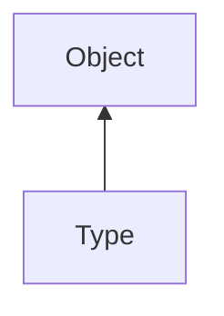

#### Inheritance Graph

## Functions

|
| ------------------------------------------------------------------------------------------------: | ---------------------------------------------- | 
| **_constructor**([p0])                                                                            | [ESMF] Type new Type( [BaseType = ExtObject] ) | 
| **[getBaseType](classEScript_1_1Type#classEScript_1_1Type_1a44cf1bde3336ae8aba408d751549cc63)**() | [ESMF] Type Type.getBaseType()                 | 
| **getObjAttributes**()                                                                            | [ESMF] Map Type.getObjAttributes()             | 
| **getTypeAttributes**()                                                                           | [ESMF] Map Type.getTypeAttributes()            | 
| **[hasBase](classEScript_1_1Type#classEScript_1_1Type_1a5c468bd015a109c79fa2d1f1982d3482)**(p0)   | [ESMF] Type Type.hasBase(Type)                 | 
| **[isBaseOf](classEScript_1_1Type#classEScript_1_1Type_1a580fd7070414f07f5df29815c98711f4)**(p0)  | [ESMF] Type Type.isBaseOf(Type)                | 
{: .nohead .nowrap1 }

