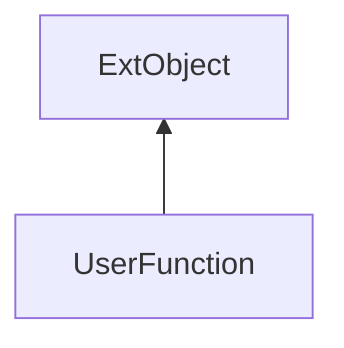

#### Inheritance Graph

## Functions

|
| ---------------------------------------------------------------------------------------------------------------------: | ---------------------------------------------------- | 
| **_asm**()                                                                                                             | [ESMF] String UserFunction._asm()                    | 
| **[getCode](classEScript_1_1UserFunction#classEScript_1_1UserFunction_1acb2c2657d5915b594558a6e3f9319b72)**()          | [ESMF] String UserFunction.getCode()                 | 
| **[getFilename](classEScript_1_1CodeFragment#classEScript_1_1CodeFragment_1a1bb5bc7704d020f27532dee162caa191)**()      | [ESMF] String UserFunction.getFilename()             | 
| **[getMaxParamCount](classEScript_1_1UserFunction#classEScript_1_1UserFunction_1a66bbeb0676eccd233a7dfad218e1cdd6)**() | [ESMF] Number\|false UserFunction.getMaxParamCount() | 
| **[getMinParamCount](classEScript_1_1UserFunction#classEScript_1_1UserFunction_1ae7580de3ef675aceaef3c4630b3bcd92)**() | [ESMF] Number UserFunction.getMinParamCount()        | 
| **[getMultiParam](classEScript_1_1UserFunction#classEScript_1_1UserFunction_1aafb64b5ac8d7eae29196d0ba588f0d23)**()    | [ESMF] Number\|false UserFunction.getMultiParam()    | 
| **[getParamCount](classEScript_1_1UserFunction#classEScript_1_1UserFunction_1a622ad56d9458e6290b6dff65e773f50d)**()    | [ESMF] Number UserFunction.getParamCount()           | 
| **usesStaticData**()                                                                                                   | [ESMF] Bool UserFunction.usesStaticData()            | 
{: .nohead .nowrap1 }

