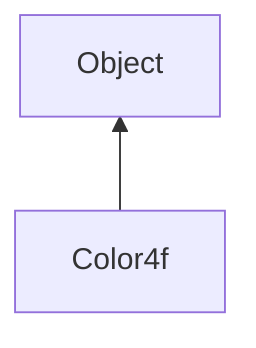

#### Inheritance Graph

## Functions

|
| ------------------------------------------: | ----------------------------------------------------------------------------------------------------------------------------------------------------------------------------------------------------------------------------------------- | 
| **\***(p0)                                  | [ESMF] Color4f Color4f."\*"( Number )                                                                                                                                                                                                     | 
| **\*=**(p0)                                 | [ESMF] thisObj Color4f."\*="( Number )                                                                                                                                                                                                    | 
| **+**(p0)                                   | [ESMF] Color4f Color4f."+"( Color4f )                                                                                                                                                                                                     | 
| **+=**(p0)                                  | [ESMF] thisObj Color4f."+="( Color4f )                                                                                                                                                                                                    | 
| **-**(p0)                                   | [ESMF] Color4f Color4f."-"( Color4f )                                                                                                                                                                                                     | 
| **-=**(p0)                                  | [ESMF] thisObj Color4f."-="( Color4f )                                                                                                                                                                                                    | 
| **/**(p0)                                   | [ESMF] Color4f Color4f."/"( Number )                                                                                                                                                                                                      | 
| **/=**(p0)                                  | [ESMF] thisObj Color4f."/="( Number )                                                                                                                                                                                                     | 
| **_constructor**([p0 [, p1 [, p2 [, p3]]]]) | [ESMF] Color4f new Color4f.(Color4ub \| Color4f \| Array \| Number, Number, Number[, Number] \| Color4f,Color4f,Number )                                                                                                                  | 
| **a**([p0])                                 | [ESMF] Number Color4f.a() \|\| thisObj Color4f.a(Number)                                                                                                                                                                                  | 
| **b**([p0])                                 | [ESMF] Number Color4f.b() \|\| thisObj Color4f.b(Number)                                                                                                                                                                                  | 
| **g**([p0])                                 | [ESMF] Number Color4f.g() \|\| thisObj Color4f.g(Number)                                                                                                                                                                                  | 
| **r**([p0])                                 | copyconstructor (Color4f) converting copy constructor (Color4ub) Array Constructor (Array) mixing constructor (Color4f,Color4f,Number) 3/4 value constructor [ESMF] Number Color4f.r() \|\| thisObj Color4f.r(Number) | 
| **toArray**()                               | [ESMF Array Color4f.toArray()                                                                                                                                                                                                             | 
{: .nohead .nowrap1 }

