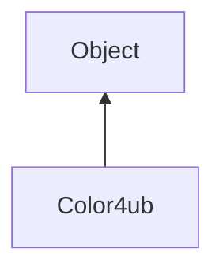

#### Inheritance Graph

## Functions

|
| ------------------------------------------------------------------------------------------------: | --------------------------------------------------------------------------------------------------------------------------------------------------------------- | 
| **_constructor**([p0 [, p1 [, p2 [, p3]]]])                                                       | [ESMF] Color4ub new Color4ub(Color4ub \| Color4f \| Array \| Number, Number, Number[, Number])                                                                  | 
| **a**([p0])                                                                                       | [ESMF] Number Color4ub.a() \|\| thisObj Color4ub.a(Number)                                                                                                      | 
| **b**([p0])                                                                                       | [ESMF] Number Color4ub.b() \|\| thisObj Color4ub.b(Number)                                                                                                      | 
| **g**([p0])                                                                                       | [ESMF] Number Color4ub.g() \|\| thisObj Color4ub.g(Number)                                                                                                      | 
| **[getAsUInt](classUtil_1_1Color4ub#classUtil_1_1Color4ub_1afd68001d44f0e4b1259d8f68502df2fd)**() | [ESMF Number Color4ub.getAsUInt()                                                                                                                               | 
| **r**([p0])                                                                                       | copy constructor converting copy constructor Array Constructor 3/4 value constructor [ESMF] Number Color4ub.r() \|\| thisObj Color4ub.r(Number) | 
| **toArray**()                                                                                     | [ESMF Array Color4ub.toArray()                                                                                                                                  | 
{: .nohead .nowrap1 }

