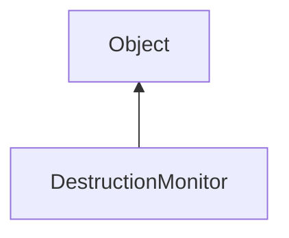

#### Inheritance Graph

## Functions

|
| ---------------------------: | ------------------------------------------------------------------------- | 
| **_constructor**()           | [ESMF] DestructionMonitor new DestructionMonitor( 0 )                     | 
| **createMarker**([p0])       | [ESMF] DestructionMarker DestructionMonitor.createMarker( [String name] ) | 
| **extractMarkers**()         | [ESMF] Array DestructionMonitor.extractMarkers()                          | 
| **getPendingMarkersCount**() | [ESMF] Number DestructionMonitor.getPendingMarkersCount()                 | 
| **getPendingMarkersNames**() | [ESMF] Array DestructionMonitor.getPendingMarkersNames()                  | 
| **markersAvailable**()       | [ESMF] Bool DestructionMonitor.markersAvailable()                         | 
{: .nohead .nowrap1 }

