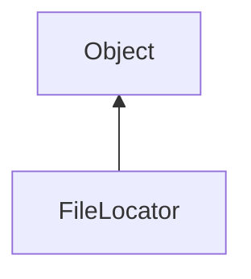

#### Inheritance Graph

## Functions

|
| -------------------------------------------------------------------------------------------------------------: | ------------------------------------------------- | 
| **_constructor**()                                                                                             | [ESF] new FileLocator                             | 
| **[addSearchPath](classUtil_1_1FileLocator#classUtil_1_1FileLocator_1ab773e13a5668dfb510a944e654570118)**(p0)  | [ESMF] thisEObj FileLocator.getPath()             | 
| **[getSearchPaths](classUtil_1_1FileLocator#classUtil_1_1FileLocator_1af303e1fdb1f7b7eeaecbba9609a39ccf)**()   | [ESMF] Array FileLocator.getSearchPaths()         | 
| **[locateFile](classUtil_1_1FileLocator#classUtil_1_1FileLocator_1aba4010c390fae45b07672a999f102cdb)**(p0)     | [ESMF] String FileLocator.locateFile(String )     | 
| **[setSearchPaths](classUtil_1_1FileLocator#classUtil_1_1FileLocator_1a85905f1b037c3d5bcf1347fce2aa4d9e)**(p0) | [ESMF] thisEObj FileLocator.setSearchPaths(Array) | 
{: .nohead .nowrap1 }

