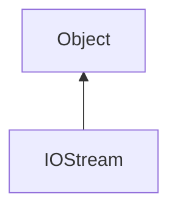

#### Inheritance Graph

## Functions

|
| -------------: | ---------------------------------------- | 
| **_get**()     | [ESMF] String\|void IOStream._get( )     | 
| **clear**()    | [ESMF] thisEObj IOStream.clear( )        | 
| **eof**()      | [ESMF] Bool IOStream.eof( )              | 
| **fail**()     | [ESMF] Bool IOStream.fail( )             | 
| **flush**()    | [ESMF] thisEObj IOStream.flush( )        | 
| **good**()     | [ESMF] Bool IOStream.good( )             | 
| **readLine**() | [ESMF] String\|void IOStream.readLine( ) | 
| **write**(p0)  | [ESMF] thisEObj IOStream.write( String ) | 
{: .nohead .nowrap1 }

