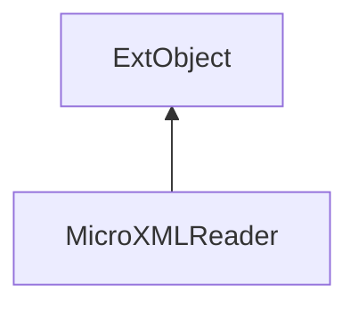

#### Inheritance Graph

## Functions

|
| -----------------: | ------------------------------------------------ | 
| **_constructor**() | [ESF] MicroXMLReader new Util.MicroXMLReader()   | 
| **data**(p0, p1)   | [ESMF] bool Util.MicroXMLReader.data(tag,data)   | 
| **enter**(p0)      | [ESMF] bool Util.MicroXMLReader.enter(tag)       | 
| **leave**(p0)      | [ESMF] bool Util.MicroXMLReader.leave(tag)       | 
| **parse**(p0)      | [ESMF] bool  Util.MicroXMLReader.parse(Filename) | 
{: .nohead .nowrap1 }

