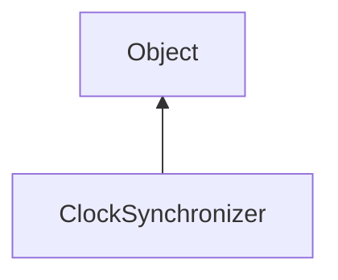

#### Inheritance Graph

## Functions

|
| -------------------------------------------------------------------------------------------------------------------------------------------------: | --------------------------------------------------------------------------- | 
| **[close](classUtil_1_1Network_1_1ClockSynchronizer#classUtil_1_1Network_1_1ClockSynchronizer_1a67c3ad830745e10af8350705fe2bf8ac)**()              | [ESMF] thisObj ClockSynchronizer.close()                                    | 
| **[createClient](classUtil_1_1Network_1_1ClockSynchronizer#classUtil_1_1Network_1_1ClockSynchronizer_1a9931c89cc88cf386559085f3ffb6beea)**(p0, p1) | [ESF] (static) ClockSynchronizer ClockSynchronizer.createClient(host, port) | 
| **[createServer](classUtil_1_1Network_1_1ClockSynchronizer#classUtil_1_1Network_1_1ClockSynchronizer_1a9b7937fae5154de5a571a92191c4496a)**(p0)     | [ESF] (static) ClockSynchronizer ClockSynchronizer.createSever(port)        | 
| **[getClockSec](classUtil_1_1Network_1_1ClockSynchronizer#classUtil_1_1Network_1_1ClockSynchronizer_1a7c4f9a78cbb3f820145eb6aa8d6e65a7)**()        | [ESMF] Number ClockSynchronizer.getClockSec()                               | 
| **[isRunning](classUtil_1_1Network_1_1ClockSynchronizer#classUtil_1_1Network_1_1ClockSynchronizer_1a37250244ea3d89e7b5c6c56436ff6eb2)**()          | [ESMF] Bool ClockSynchronizer.isRunning()                                   | 
{: .nohead .nowrap1 }

