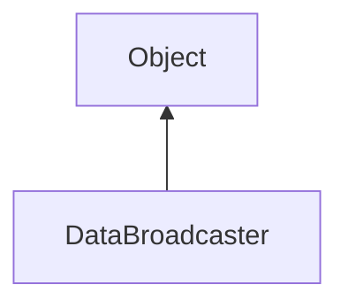

#### Inheritance Graph

## Functions

|
| ----------------------------------------------------------------------------------------------------------------------------------------------: | ------------------------------------------------------------------ | 
| **_constructor**()                                                                                                                              | [ESF] new DataBroadcaster()                                        | 
| **[addDataConnection](classUtil_1_1Network_1_1DataBroadcaster#classUtil_1_1Network_1_1DataBroadcaster_1aac4f045ebbddb04372a20253625d48b4)**(p0) | [ESMF] thisObj DataBroadcaster.addDataConnection(E_DataConnection) | 
{: .nohead .nowrap1 }

