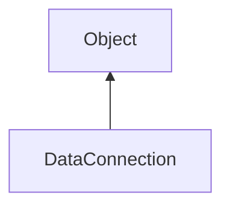

#### Inheritance Graph

## Functions

|
| ----------------------------------------------------------------------------------------------------------------------------------------: | --------------------------------------- | 
| **_constructor**(p0)                                                                                                                      | [ESF] new DataConnection(TCPConnection) | 
| **[close](classUtil_1_1Network_1_1DataConnection#classUtil_1_1Network_1_1DataConnection_1af9be8f97ae2f0b7200de467ae86f5ae3)**()           | [ESMF] thisObj DataConnection.close()   | 
| **[isOpen](classUtil_1_1Network_1_1DataConnection#classUtil_1_1Network_1_1DataConnection_1aa0a0c5006c3f47113c410dcbc1e84e4e)**()          | [ESMF] Bool DataConnection.isOpen()     | 
| **receiveValue**()                                                                                                                        |                                         | 
| **[sendValue](classUtil_1_1Network_1_1DataConnection#classUtil_1_1Network_1_1DataConnection_1a397dc2a957a2489f26c78a70a59ae95b)**(p0, p1) |                                         | 
{: .nohead .nowrap1 }

