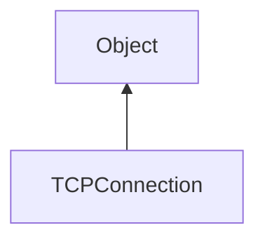

#### Inheritance Graph

## Functions

|
| ------------------------------------------------------------------------------------------------------------------------------------------: | -------------------------------------------------------------------------- | 
| **[close](classUtil_1_1Network_1_1TCPConnection#classUtil_1_1Network_1_1TCPConnection_1a433369e8696ac75664f057cdce0e0011)**()               | [ESMF] thisObj TCPConnection.close()                                       | 
| **[connect](classUtil_1_1Network_1_1TCPConnection#classUtil_1_1Network_1_1TCPConnection_1a766282d984690ca07dee24885bfb040a)**(p0, p1)       | [ESF] (static) TCPConnection\|false TCPConnection.connect(host,port)       | 
| **[isOpen](classUtil_1_1Network_1_1TCPConnection#classUtil_1_1Network_1_1TCPConnection_1a297a1171cf824d1c755ae5a5b871657a)**()              | [ESMF] thisObj TCPConnection.isOpen()                                      | 
| **[receiveString](classUtil_1_1Network_1_1TCPConnection#classUtil_1_1Network_1_1TCPConnection_1a0932fe57adea76a0e1a768d790603f1b)**([p0])   | [ESMF] String\|false TCPConnection.receiveString([delimiter='\0'\|length]) | 
| **[sendString](classUtil_1_1Network_1_1TCPConnection#classUtil_1_1Network_1_1TCPConnection_1acc769079a0a605f615e37d355913906a)**(p0 [, p1]) | [ESMF] thisObj TCPConnection.sendString(String,[delimiter='\0'])           | 
{: .nohead .nowrap1 }

