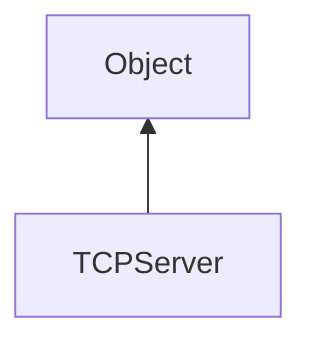

#### Inheritance Graph

## Functions

|
| ------------------------------------------------------------------------------------------------------------------------------------: | ------------------------------------------------------------- | 
| **[close](classUtil_1_1Network_1_1TCPServer#classUtil_1_1Network_1_1TCPServer_1a5d79f1cb8378e2070a207d49c40446ea)**()                 | [ESMF] thisObj TCPServer.close()                              | 
| **[create](classUtil_1_1Network_1_1TCPServer#classUtil_1_1Network_1_1TCPServer_1aef3e9da0d6424884d4a3efa7584eb6cf)**(p0)              | [ESF] (static) TCPServer\|false TCPServer.create(port)        | 
| **[getIncomingConnection](classUtil_1_1Network_1_1TCPServer#classUtil_1_1Network_1_1TCPServer_1a3af93610f8eb52d83e2626a28bd8bbb5)**() | [ESMF] TCPConnection\|false TCPServer.getIncomingConnection() | 
| **[isOpen](classUtil_1_1Network_1_1TCPServer#classUtil_1_1Network_1_1TCPServer_1a6acf67050a083a571a1b8555aef24674)**()                | [ESMF] bool TCPServer.isOpen()                                | 
{: .nohead .nowrap1 }

