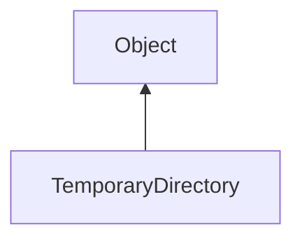

#### Inheritance Graph

## Functions

|
| ------------------------------------------------------------------------------------------------------------------: | ------------------------------------------ | 
| **_constructor**(p0)                                                                                                | [ESF] new TemporaryDirectory(String)       | 
| **[getPath](classUtil_1_1TemporaryDirectory#classUtil_1_1TemporaryDirectory_1a0a4acbad403f9cbffd6de8e0ae459b3f)**() | [ESMF] String TemporaryDirectory.getPath() | 
{: .nohead .nowrap1 }

