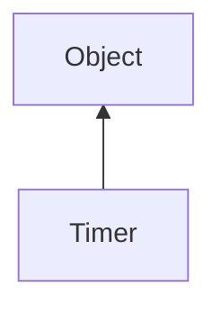

#### Inheritance Graph

## Functions

|
| ------------------------------------------------------------------------------------------------: | ------------------------------------- | 
| **_constructor**()                                                                                | [ESF] Timer new Timer()               | 
| **[getMicroseconds](classUtil_1_1Timer#classUtil_1_1Timer_1ac2565023d581f68476ee32b17eb1d229)**() | [ESMF] Number Timer.getMicroseconds() | 
| **[getMilliseconds](classUtil_1_1Timer#classUtil_1_1Timer_1a05e433358ac68c94d92981a0f96dc981)**() | [ESMF] Number Timer.getMilliseconds() | 
| **[getNanoseconds](classUtil_1_1Timer#classUtil_1_1Timer_1ad832ba7aac35e71134b2fbad0651cf7e)**()  | [ESMF] Number Timer.getNanoseconds()  | 
| **[getSeconds](classUtil_1_1Timer#classUtil_1_1Timer_1add5213f26f6a114b6321b585c373e0a9)**()      | [ESMF] Number Timer.getSeconds()      | 
| **[isRunning](classUtil_1_1Timer#classUtil_1_1Timer_1a26dbc4c8bde0498cfc65bd046c58d71e)**()       | [ESMF] Bool Timer.isRunning()         | 
| **[now](classUtil_1_1Timer#classUtil_1_1Timer_1a77bdc1605040a568b7732dfb92340dfa)**()             | [ESF] (static) Number Timer.now()     | 
| **[reset](classUtil_1_1Timer#classUtil_1_1Timer_1aff6379534fff8db6ce32d2db40c90d00)**()           | [ESMF] thisObj Timer.reset()          | 
| **[resume](classUtil_1_1Timer#classUtil_1_1Timer_1a2160a538caad6fc84a84f8a864384181)**()          | [ESMF] thisObj Timer.resume()         | 
| **[stop](classUtil_1_1Timer#classUtil_1_1Timer_1a462dc6312e69bbf03e169fff832bd562)**()            | [ESMF] thisObj Timer.stop()           | 
{: .nohead .nowrap1 }

