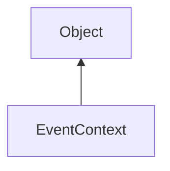

#### Inheritance Graph

## Functions

|
| -------------------------------------------------------------------------------------------------------------------------: | ---------------------------------------------- | 
| **_constructor**()                                                                                                         | [ESF] new EventContext()                       | 
| **[getEventQueue](classUtil_1_1UI_1_1EventContext#classUtil_1_1UI_1_1EventContext_1a57d0e9472d2c55287fc52624655e2bb9)**()  | [ESMF] EventQueue EventContext.getEventQueue() | 
| **[isAltPressed](classUtil_1_1UI_1_1EventContext#classUtil_1_1UI_1_1EventContext_1abf2decb9155891599019b27ef199c6bd)**()   | [ESMF] Bool EventContext.isAltPressed()        | 
| **[isCtrlPressed](classUtil_1_1UI_1_1EventContext#classUtil_1_1UI_1_1EventContext_1a78f43a9a627e035d31e62f93180b5130)**()  | [ESMF] Bool EventContext.isCtrlPressed()       | 
| **[isKeyPressed](classUtil_1_1UI_1_1EventContext#classUtil_1_1UI_1_1EventContext_1a2db9187e258cbab0826c1772b7ea9d69)**(p0) | [ESMF] Bool EventContext.isKeyPressed(Number)  | 
| **[isShiftPressed](classUtil_1_1UI_1_1EventContext#classUtil_1_1UI_1_1EventContext_1a20f0f0b54eff336ca370858d00354b03)**() | [ESMF] Bool EventContext.isShiftPressed()      | 
{: .nohead .nowrap1 }

