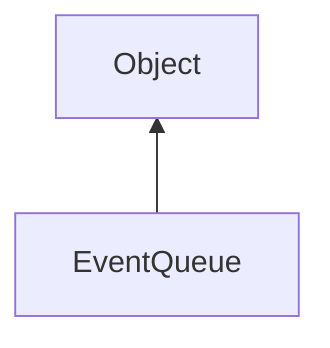

#### Inheritance Graph

## Functions

|
| ----------------------------------------------------------------------------------------------------------------------------: | ------------------------------------------------ | 
| **[getNumEventsAvailable](classUtil_1_1UI_1_1EventQueue#classUtil_1_1UI_1_1EventQueue_1a03e6797c98493167b544c20c47aad272)**() | [ESMF] Number EventQueue.getNumEventsAvailable() | 
| **[peekEvent](classUtil_1_1UI_1_1EventQueue#classUtil_1_1UI_1_1EventQueue_1a5f4f8d5626a674902f501c4b20918919)**()             | [ESMF] Event EventQueue.peekEvent()              | 
| **[popEvent](classUtil_1_1UI_1_1EventQueue#classUtil_1_1UI_1_1EventQueue_1a383f9b5ed7dfdf2076964a9c3651b61d)**()              | [ESMF] Event EventQueue.popEvent()               | 
| **[process](classUtil_1_1UI_1_1EventQueue#classUtil_1_1UI_1_1EventQueue_1a6673bc50781be1f3dbda43cfa2fe98b6)**()               | [ESMF] Void EventQueue.process()                 | 
| **registerWindow**(p0)                                                                                                        | [ESMF] Void EventQueue.registerWindow()          | 
{: .nohead .nowrap1 }

