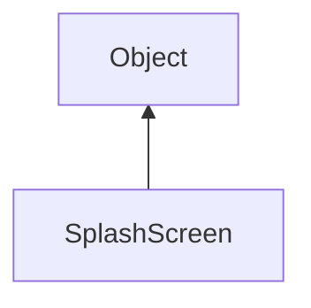

#### Inheritance Graph

## Functions

|
| -----------------------: | -------------------------------------------------------------------- | 
| **_constructor**(p0, p1) | [ESMF] SplashScreen new SplashScreen(String title, String imagePath) | 
| **destroy**()            | [ESMF] Void SplashScreen.destroy()                                   | 
| **showMessage**(p0)      | [ESMF] Void SplashScreen.showMessage(String)                         | 
{: .nohead .nowrap1 }

