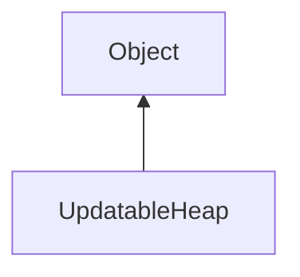

#### Inheritance Graph

## Functions

|
| -------------------------------------------------------------------------------------------------------------: | ----------------------------------------------------------------- | 
| **_constructor**()                                                                                             | [ESF] UpdatableHeap new UpdatableHeap()                           | 
| **[clear](classUtil_1_1UpdatableHeap#classUtil_1_1UpdatableHeap_1af9e6060e9d224423e8f71c4cdde4f37e)**()        | [ESMF] thisObj UpdatableHeap.clear()                              | 
| **[erase](classUtil_1_1UpdatableHeap#classUtil_1_1UpdatableHeap_1a3aecd854fd5a8d7044ed1d7ca67d68d5)**(p0)      | [ESMF] thisObj UpdatableHeap.erase(UpdatableHeapElement)          | 
| **[insert](classUtil_1_1UpdatableHeap#classUtil_1_1UpdatableHeap_1a92fc2539279c299f0c6e77e7bd20f864)**(p0, p1) | [ESMF] UpdatableHeapElement UpdatableHeap.insert(Number, Object)  | 
| **[pop](classUtil_1_1UpdatableHeap#classUtil_1_1UpdatableHeap_1a95f47a40ddc79ef79e3190c1d68b4a77)**()          | [ESMF] thisObj UpdatableHeap.pop()                                | 
| **[size](classUtil_1_1UpdatableHeap#classUtil_1_1UpdatableHeap_1a4715aa8a84a2a2d4c05889162464198b)**()         | [ESMF] Number UpdatableHeap.size()                                | 
| **[top](classUtil_1_1UpdatableHeap#classUtil_1_1UpdatableHeap_1a37d2d3d4357c6252010ecfb2d8e7840f)**()          | [ESMF] UpdatableHeapElement UpdatableHeap.top()                   | 
| **[update](classUtil_1_1UpdatableHeap#classUtil_1_1UpdatableHeap_1a5f58add906050e0f15bc9819387a4746)**(p0, p1) | [ESMF] thisObj UpdatableHeap.update(UpdatableHeapElement, Number) | 
{: .nohead .nowrap1 }

